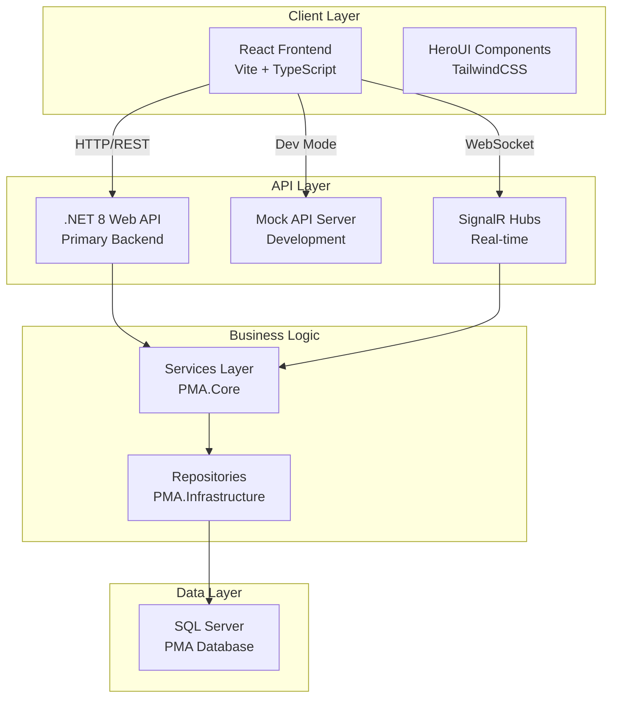
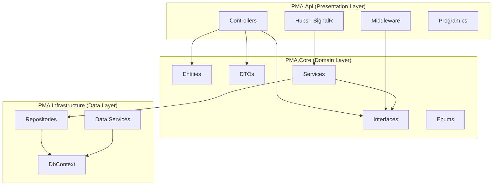
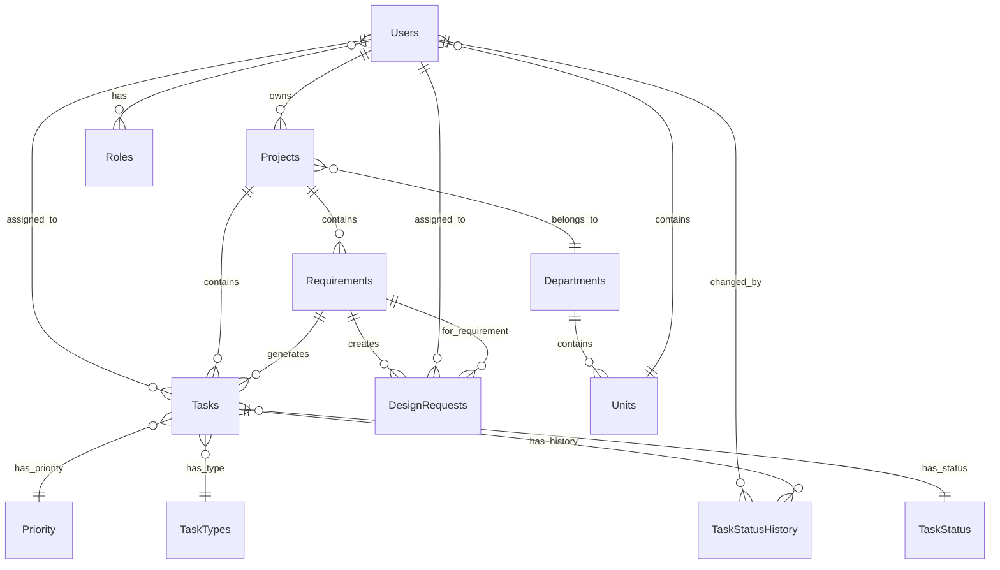
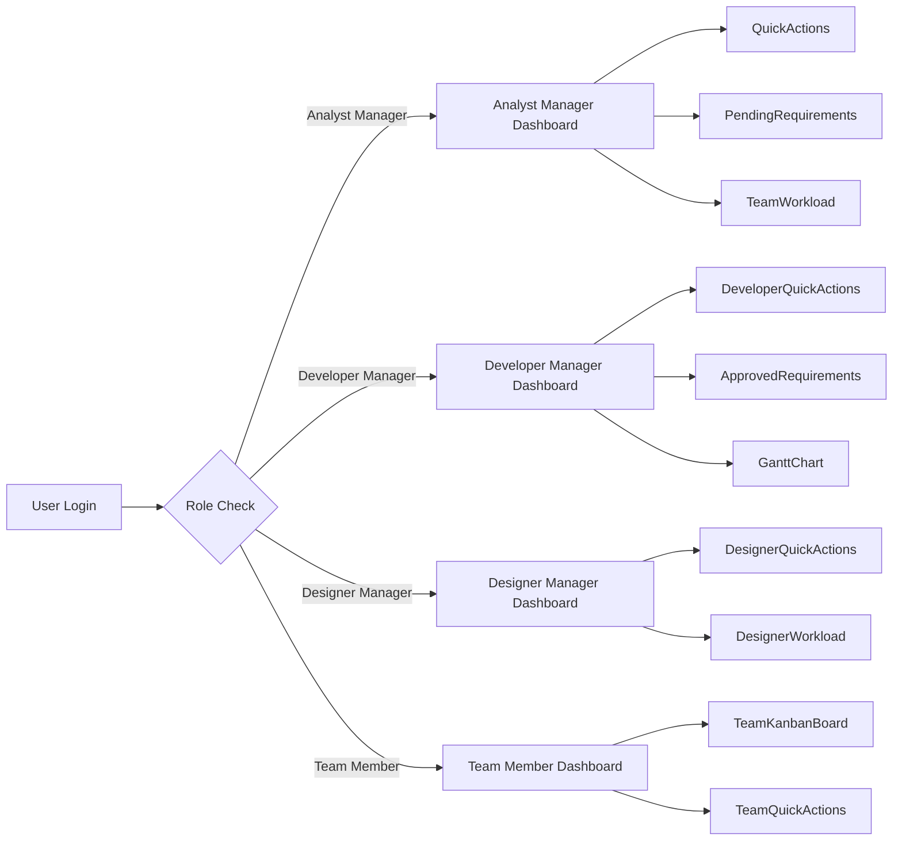

# Project Management Application (PMA) - Comprehensive Documentation

**Version:** 1.0  
**Last Updated:** January 2025  
**Project Type:** Full-Stack Web Application  
**Primary Languages:** TypeScript (95%), C# (.NET 8), JavaScript  

---

## Table of Contents

1. [Executive Summary](#executive-summary)
2. [Technology Stack](#technology-stack)
3. [Project Architecture](#project-architecture)
4. [Frontend Architecture](#frontend-architecture)
5. [Backend Architecture](#backend-architecture)
6. [Database Schema](#database-schema)
7. [Authentication & Authorization](#authentication--authorization)
8. [Features & Pages](#features--pages)
9. [Dashboard System](#dashboard-system)
10. [API Reference](#api-reference)
11. [Data Flow & State Management](#data-flow--state-management)
12. [UI/UX Design System](#uiux-design-system)
13. [Development Workflow](#development-workflow)
14. [Code Organization & Conventions](#code-organization--conventions)
15. [Deployment Guide](#deployment-guide)
16. [Troubleshooting](#troubleshooting)
17. [Best Practices](#best-practices)

---

## Executive Summary

The Project Management Application (PMA) is a comprehensive, enterprise-grade project management system built with modern web technologies. It provides tools for managing projects, tasks, timelines, team collaboration, and role-based dashboards for different user types.

### Key Capabilities

- ✅ **Multi-Role Dashboard System**: 4 specialized dashboards (Analyst Manager, Developer Manager, Designer Manager, Team Member)
- ✅ **Task Management**: Kanban board with drag-and-drop, role-based permissions, adhoc task quick completion
- ✅ **Real-Time Communication**: SignalR integration for live updates
- ✅ **Bilingual Support**: Full English/Arabic support with RTL layout
- ✅ **Timeline Visualization**: Gantt charts using dhtmlx-gantt and wx-react-gantt
- ✅ **Requirements Management**: Draft, approval, and tracking workflows
- ✅ **Design Request Management**: Designer assignment and workload tracking
- ✅ **Team Workload Analytics**: Performance metrics and capacity planning
- ✅ **Advanced Search**: Global search across projects, tasks, and requirements

### Target Users

| Role | ID | Description |
|------|-----|------------|
| Administrator | 1 | Full system access, configuration management |
| Analyst Department Manager | 2 | Requirements oversight, team workload |
| Analyst | 3 | Requirements analysis and documentation |
| Development Manager | 4 | Development team coordination, code reviews |
| Software Developer | 5 | Feature development, task completion |
| Quality Control Manager | 6 | QC team oversight, testing coordination |
| Quality Control Team Member | 7 | Testing and quality assurance |
| Designer Manager | 8 | Design team management, request assignment |
| Designer Team Member | 9 | UI/UX design task execution |

---

## Technology Stack

### Frontend Technologies

#### Core Framework & Build Tools
- **React 18.3.1** - Frontend library with Hooks, Context API, functional components
- **TypeScript 5.x** - Static typing with strict mode enabled
- **Vite 4.7.0** - Fast build tool with HMR (Hot Module Replacement)
- **React Router 6.23.0** - Client-side routing with protected routes

#### UI & Styling
- **HeroUI 2.8.2** - Modern component library (NextUI successor)
  - 25+ component packages (@heroui/button, @heroui/card, @heroui/modal, etc.)
- **TailwindCSS 4.1.11** - Utility-first CSS framework
- **Framer Motion 11.18.2** - Animation library for smooth transitions
- **Lucide React 0.539.0** - Icon library with 1000+ icons

#### State Management & Data Fetching
- **React Query 5.89.0** (@tanstack/react-query) - Server state management
- **Context API** - Global state for User, Language, Notifications, Search

#### Date & Time
- **date-fns 4.1.0** - Date manipulation and formatting
- **@internationalized/date 3.8.2** - Internationalized date handling

#### Charts & Visualizations
- **dhtmlx-gantt 9.0.15** - Enterprise Gantt chart library
- **wx-react-gantt 1.3.1** - React wrapper for Gantt charts
- **recharts 3.2.0** - Composable charting library

#### Rich Content
- **quill 2.0.3** - WYSIWYG rich text editor
- **react-quill 2.0.0** - React wrapper for Quill
- **pdfjs-dist 5.4.149** - PDF rendering library
- **react-pdf 10.1.0** - React PDF viewer component

#### Notifications & Feedback
- **react-hot-toast 2.6.0** - Toast notification system
- **SignalR 8.0.17** (@microsoft/signalr) - Real-time web communication

#### Development Tools
- **ESLint 9.25.1** - Code linting with TypeScript support
- **Prettier** (via ESLint plugin) - Code formatting
- **TypeScript ESLint 8.31.1** - TypeScript-specific linting rules
- **Concurrently 9.2.1** - Run multiple dev servers simultaneously

### Backend Technologies

#### .NET API Server (Primary Backend)
- **.NET 8.0** - Modern, cross-platform framework
- **ASP.NET Core Web API** - RESTful API endpoints
- **Entity Framework Core** - ORM for database operations
- **SQL Server** - Production database (DESKTOP-88VGRA9, Database: PMA)
- **SignalR Hubs** - Real-time server-side communication

#### Mock API Server (Development)
- **Node.js** - JavaScript runtime
- **Express.js** - Web application framework
- **TypeScript** - Type-safe backend code
- **Mock data generators** - Realistic test data

### Database
- **Microsoft SQL Server** - Relational database
- **Entity Framework Core Migrations** - Schema version control
- **Database:** PMA (DESKTOP-88VGRA9)

---

## Project Architecture

### High-Level Architecture Diagram



### Directory Structure

```
Project-Management/
├── src/                           # Frontend source code
│   ├── components/                # Reusable UI components
│   │   ├── dashboard/             # Dashboard components
│   │   │   ├── team-member/       # Team member specific
│   │   │   ├── developer/         # Developer specific
│   │   │   ├── designer/          # Designer specific
│   │   │   └── calendar/          # Calendar components
│   │   ├── members-tasks/         # Task card components
│   │   └── timeline/              # Timeline/Gantt components
│   ├── pages/                     # Route pages
│   ├── hooks/                     # Custom React hooks (40+)
│   ├── services/                  # API service layer
│   │   └── api/                   # API client services (20+)
│   ├── contexts/                  # React contexts (4)
│   │   ├── LanguageContext.tsx    # Bilingual support
│   │   ├── UserContext.tsx        # User authentication
│   │   ├── NotificationContext.tsx # Notifications
│   │   └── SearchContext.tsx      # Global search
│   ├── types/                     # TypeScript definitions
│   ├── utils/                     # Utility functions
│   ├── constants/                 # App constants
│   ├── layouts/                   # Page layouts
│   └── styles/                    # Global styles
├── pma-api-server/                # .NET 8 Backend API
│   └── src/
│       ├── PMA.Api/               # Web API layer
│       │   ├── Controllers/       # API endpoints (20+)
│       │   ├── Services/          # Application services
│       │   ├── Hubs/              # SignalR hubs
│       │   └── Middleware/        # Custom middleware
│       ├── PMA.Core/              # Domain layer
│       │   ├── Entities/          # Domain entities
│       │   ├── DTOs/              # Data transfer objects
│       │   ├── Enums/             # Enumerations
│       │   ├── Interfaces/        # Service interfaces
│       │   └── Services/          # Domain services
│       └── PMA.Infrastructure/    # Data layer
│           ├── Data/              # DbContext
│           ├── Repositories/      # Data access
│           └── Services/          # Infrastructure services
├── mock-api-server/               # Development mock API
│   └── src/
│       ├── controllers/           # Mock controllers
│       ├── routes/                # API routes
│       ├── services/              # Mock services
│       └── data/                  # Mock data
└── public/                        # Static assets
```

### Configuration Files

| File | Purpose |
|------|---------|
| `package.json` | Frontend dependencies and scripts |
| `vite.config.ts` | Vite build configuration |
| `tsconfig.json` | TypeScript compiler options (strict mode) |
| `tailwind.config.js` | TailwindCSS theme and plugins |
| `eslint.config.mjs` | ESLint rules and plugins |
| `.env.example` | Environment variables template |
| `PMA.Api.csproj` | .NET project configuration |
| `appsettings.json` | .NET API configuration |

---

## Frontend Architecture

### React Application Structure

#### Entry Point (`main.tsx`)
```typescript
import React from 'react';
import ReactDOM from 'react-dom/client';
import App from './App.tsx';
import { BrowserRouter } from 'react-router-dom';
import { QueryClientProvider } from '@tanstack/react-query';
import { queryClient } from './config/queryClient.tsx';
import './styles/index.css';

ReactDOM.createRoot(document.getElementById('root')!).render(
  <React.StrictMode>
    <BrowserRouter>
      <QueryClientProvider client={queryClient}>
        <App />
      </QueryClientProvider>
    </BrowserRouter>
  </React.StrictMode>
);
```

#### Provider Setup (`provider.tsx`)
The application uses a centralized provider pattern:
- **UserProvider**: User authentication and profile data
- **LanguageProvider**: Bilingual support (English/Arabic)
- **NotificationProvider**: Real-time notifications via SignalR
- **SearchProvider**: Global search context

### Build Configuration

#### Vite Configuration (`vite.config.ts`)
```typescript
import { defineConfig } from 'vite';
import react from '@vitejs/plugin-react';
import tsconfigPaths from 'vite-tsconfig-paths';
import tailwindcss from '@tailwindcss/vite';

export default defineConfig({
  plugins: [
    react(),              // React fast refresh
    tsconfigPaths(),      // TypeScript path resolution
    tailwindcss()         // Tailwind JIT compilation
  ],
  resolve: {
    alias: {
      '@': path.resolve(__dirname, './src')  // @ alias for imports
    }
  }
});
```

**Features:**
- Fast HMR (Hot Module Replacement) for instant updates
- Optimized production builds with code splitting
- TypeScript path aliases (`@/components`, `@/hooks`, etc.)
- TailwindCSS JIT (Just-In-Time) compilation

#### TypeScript Configuration (`tsconfig.json`)
```jsonc
{
  "compilerOptions": {
    "target": "ES2020",
    "lib": ["ES2020", "DOM", "DOM.Iterable"],
    "module": "ESNext",
    "strict": true,                    // Strict type checking
    "jsx": "react-jsx",
    "moduleResolution": "bundler",
    "paths": {
      "@/*": ["./src/*"]               // Path mapping
    },
    "noUnusedLocals": false,
    "noUnusedParameters": false,
    "noFallthroughCasesInSwitch": true
  }
}
```

**Key Features:**
- Strict mode enabled for type safety
- ES2020 target for modern JavaScript features
- Path mapping for clean imports
- React JSX transform

### Component Architecture

#### Component Categories

1. **Page Components** (`src/pages/`)
   - Route-level components
   - Data fetching orchestration
   - Layout composition
   - Examples: `requirements.tsx`, `members-tasks.tsx`, `timeline.tsx`

2. **Dashboard Components** (`src/components/dashboard/`)
   - Role-specific dashboards (4 types)
   - Reusable dashboard widgets
   - Examples: `AnalystManagerDashboard.tsx`, `TeamMemberDashboard.tsx`

3. **Shared Components** (`src/components/`)
   - Reusable UI components
   - Examples: `GlobalPagination.tsx`, `Calendar.tsx`, `navbar.tsx`

4. **Feature Components** (subdirectories)
   - Feature-specific components
   - Examples: `team-member/TeamKanbanBoard.tsx`, `developer/DeveloperQuickActions.tsx`

#### Component Design Patterns

**1. Custom Hooks for Data Fetching**
```typescript
// src/hooks/useMyAssignedTasks.ts
export function useMyAssignedTasks(limit?: number) {
  const [tasks, setTasks] = useState<MemberTask[]>([]);
  const [loading, setLoading] = useState(true);
  const [error, setError] = useState<string | null>(null);

  const fetchTasks = async () => {
    setLoading(true);
    const response = await membersTasksService.getTasks();
    if (response.success) {
      setTasks(response.data || []);
    } else {
      setError(response.message);
    }
    setLoading(false);
  };

  useEffect(() => {
    fetchTasks();
  }, [limit]);

  return { tasks, loading, error, refetch: fetchTasks };
}
```

**Benefits:**
- Separation of concerns (data fetching separate from UI)
- Reusability across components
- Consistent error handling
- Easy testing

**2. Service Layer Pattern**
```typescript
// src/services/api/tasksService.ts
class TasksService {
  async updateTaskStatus(
    taskId: number,
    statusId: number,
    comment?: string,
    progress?: number
  ): Promise<ApiResponse<any>> {
    return await apiClient.patch(`/Tasks/${taskId}`, {
      statusId,
      comment,
      progress
    });
  }
}

export const tasksService = new TasksService();
```

**Benefits:**
- Centralized API logic
- Type-safe requests and responses
- Easy to mock for testing
- Consistent error handling

**3. Context API for Global State**
```typescript
// src/contexts/UserContext.tsx
export function UserProvider({ children }: { children: React.ReactNode }) {
  const [user, setUser] = useState<User | null>(null);
  const [loading, setLoading] = useState(true);

  const fetchUser = async () => {
    const response = await userService.getCurrentUser();
    if (response.success) {
      setUser(response.data);
      localStorage.setItem('currentUser', JSON.stringify(response.data));
    }
    setLoading(false);
  };

  useEffect(() => {
    fetchUser();
  }, []);

  return (
    <UserContext.Provider value={{ user, loading, refetch: fetchUser }}>
      {children}
    </UserContext.Provider>
  );
}
```

**Benefits:**
- Avoid prop drilling
- Centralized state management
- localStorage persistence
- Prevents duplicate API calls

### Routing Structure

#### Route Configuration
```typescript
// src/App.tsx (simplified)
<Routes>
  <Route path="/" element={<IndexPage />} />
  <Route path="/projects" element={<ProjectsPage />} />
  <Route path="/requirements" element={<RequirementsPage />} />
  <Route path="/approval-requests" element={<ApprovalRequestsPage />} />
  <Route path="/members-tasks" element={<MembersTasksPage />} />
  <Route path="/timeline" element={<TimelinePage />} />
  <Route path="/design-requests" element={<DesignRequestsPage />} />
  <Route path="/profile" element={<ProfilePage />} />
  {/* ... more routes */}
</Routes>
```

#### Protected Routes Pattern
```typescript
// Role-based dashboard rendering (src/pages/index.tsx)
export default function IndexPage() {
  const { hasAnyRoleById, loading } = usePermissions();

  if (loading) return <LoadingLogo />;

  const hasAnalystRole = hasAnyRoleById([RoleIds.ANALYST_DEPARTMENT_MANAGER]);
  const hasDevManagerRole = hasAnyRoleById([RoleIds.DEVELOPMENT_MANAGER]);
  const hasDesignerManagerRole = hasAnyRoleById([RoleIds.DESIGNER_MANAGER]);
  const isTeamMember = hasAnyRoleById([
    RoleIds.QUALITY_CONTROL_TEAM_MEMBER,
    RoleIds.SOFTWARE_DEVELOPER,
    RoleIds.ANALYST,
    RoleIds.DESIGNER_TEAM_MEMBER
  ]);

  return (
    <>
      {hasAnalystRole && <AnalystManagerDashboard />}
      {hasDevManagerRole && <DeveloperManagerDashboard />}
      {hasDesignerManagerRole && <DesignerManagerDashboard />}
      {isTeamMember && <TeamMemberDashboard />}
    </>
  );
}
```

### Custom Hooks Inventory (40+ hooks)

| Hook Name | Purpose | Location |
|-----------|---------|----------|
| `useCurrentUser` | Get current authenticated user | `hooks/useCurrentUser.ts` |
| `usePermissions` | Role-based permission checking | `hooks/usePermissions.ts` |
| `useMyAssignedTasks` | Fetch user's assigned tasks | `hooks/useMyAssignedTasks.ts` |
| `useTeamQuickActions` | Quick task status updates | `hooks/useTeamQuickActions.ts` |
| `useTaskLookups` | Fetch task status/priority lookups | `hooks/useTaskLookups.ts` |
| `useProjectDetails` | Fetch project details by ID | `hooks/useProjectDetails.ts` |
| `useDesignerWorkload` | Designer workload metrics | `hooks/useDesignerWorkload.ts` |
| `useDesignRequests` | Design request management | `hooks/useDesignRequests.ts` |
| `useDeveloperQuickActions` | Developer quick actions data | `hooks/useDeveloperQuickActions.ts` |
| `useQuickActions` | Analyst quick actions data | `hooks/useQuickActions.ts` |
| `useTimeline` | Timeline/Gantt data | `hooks/useTimeline.ts` |
| `useCalendar` | Calendar events | `hooks/useCalendar.ts` |
| `useGlobalSearch` | Global search functionality | `hooks/useGlobalSearch.ts` |
| `useNotifications` | Real-time notifications | `hooks/useNotifications.ts` |
| `usePageTitle` | Dynamic page titles | `hooks/usePageTitle/` |
| ... and 25+ more | Various data fetching and UI logic | `hooks/` |

### API Client Configuration

#### Client Setup (`src/services/api/client.ts`)
```typescript
export const API_CONFIG = {
  BASE_URL: window.PMA_CONFIG?.apiUrl || 
            import.meta.env.VITE_API_URL || 
            'http://localhost:3002/api',
  WS_URL: window.PMA_CONFIG?.wsUrl || 
          import.meta.env.VITE_WS_URL || 
          'ws://localhost:3002',
  TIMEOUT: 20000,
  USE_MOCK_API: import.meta.env.VITE_USE_MOCK_API === 'true',
  ENABLE_SIGNALR: window.PMA_CONFIG?.enableSignalR !== undefined
    ? window.PMA_CONFIG.enableSignalR
    : import.meta.env.VITE_ENABLE_SIGNALR === 'true'
};

class ApiClient {
  async request<T>(
    endpoint: string,
    method: HttpMethod,
    data?: any,
    headers?: Record<string, string>
  ): Promise<ApiResponse<T>> {
    const url = `${this.baseURL}${endpoint}`;
    const response = await fetch(url, {
      method,
      headers: { ...this.defaultHeaders, ...this.getAuthHeader(), ...headers },
      credentials: 'include',
      signal: AbortSignal.timeout(this.timeout),
      body: data ? JSON.stringify(data) : undefined
    });
    
    return await this.handleResponse<T>(response);
  }
}

export const apiClient = new ApiClient();
```

**Features:**
- Runtime configuration support (window.PMA_CONFIG)
- Environment variable fallbacks
- Timeout protection (20 seconds)
- Automatic authorization header injection
- Error handling with ApiError class
- Debug logging (configurable)

### API Service Layer (20+ services)

| Service | Endpoints | Purpose |
|---------|-----------|---------|
| `tasksService` | `/Tasks` | Task CRUD, status updates with audit trail |
| `membersTasksService` | `/MembersTasks` | Current user's tasks, next deadline |
| `projectRequirementsService` | `/ProjectRequirements` | Requirements CRUD, approval workflows |
| `quickActionsService` | `/QuickActions` | Unassigned projects, analyst assignment |
| `developerQuickActionsService` | `/DeveloperQuickActions` | Unassigned tasks, developer assignment |
| `designRequestsService` | `/DesignRequests` | Design request management, assignment |
| `designerWorkloadService` | `/Designers` | Workload metrics, team performance |
| `timelineService` | `/Timeline` | Gantt chart data, task dependencies |
| `calendarService` | `/Calendar` | Events, meetings, deadlines |
| `userService` | `/Users` | User profile, roles, permissions |
| `projectsService` | `/Projects` | Project CRUD operations |
| `departmentService` | `/Departments` | Department hierarchy |
| `lookupService` | `/Lookup` | Task statuses, priorities, types |
| `pipelineService` | `/Pipeline` | Project pipeline stages |
| `teamWorkloadService` | `/TeamWorkload` | Team performance metrics |
| ... and 5+ more | Various endpoints | Specialized functionality |

---

## Backend Architecture

### .NET 8 Web API Structure

The backend follows **Clean Architecture** principles with clear separation of concerns across three main projects:



### Project Layers

#### 1. PMA.Api (Presentation Layer)
**Location:** `pma-api-server/src/PMA.Api/`

**Responsibilities:**
- HTTP request handling
- API endpoint routing
- Authentication/Authorization middleware
- SignalR real-time communication hubs
- Request/Response transformation
- Dependency injection configuration

**Key Components:**

**Controllers (29 controllers):**
| Controller | Endpoints | Purpose |
|------------|-----------|---------|
| `TasksController` | `/api/Tasks` | Task CRUD, status updates with audit trail |
| `MembersTasksController` | `/api/MembersTasks` | User-specific task queries, next deadline |
| `ProjectsController` | `/api/Projects` | Project management CRUD operations |
| `ProjectRequirementsController` | `/api/ProjectRequirements` | Requirements management, approval workflows |
| `RequirementsController` | `/api/Requirements` | Generic requirements operations |
| `DesignRequestsController` | `/api/DesignRequests` | Design request management, assignment |
| `DesignersController` | `/api/Designers` | Designer workload metrics, team performance |
| `DashboardStatsController` | `/api/DashboardStats` | Dashboard statistics and metrics |
| `QuickActionsController` | `/api/QuickActions` | Analyst quick actions data |
| `DeveloperQuickActionsController` | `/api/DeveloperQuickActions` | Developer quick actions data |
| `TeamWorkloadController` | `/api/TeamWorkload` | Team workload performance metrics |
| `PipelineController` | `/api/Pipeline` | Project pipeline stages |
| `TimelineController` | `/api/Timeline` | Gantt chart data, task dependencies |
| `CalendarController` | `/api/Calendar` | Events, meetings, deadlines |
| `UsersController` | `/api/Users` | User management, current user profile |
| `RolesController` | `/api/Roles` | Role and permission management |
| `DepartmentsController` | `/api/Departments` | Department hierarchy |
| `UnitsController` | `/api/Units` | Organizational unit management |
| `LookupsController` | `/api/Lookups` | Lookup data (statuses, priorities, types) |
| `NotificationsController` | `/api/Notifications` | Notification management |
| `SprintsController` | `/api/Sprints` | Sprint/iteration management |
| `SubtasksController` | `/api/Subtasks` | Subtask operations |
| `EmployeesController` | `/api/Employees` | Employee search and management |
| `DeveloperTeamController` | `/api/DeveloperTeam` | Developer team operations |
| `DeveloperWorkloadController` | `/api/DeveloperWorkload` | Developer workload metrics |
| `RequirementCompletionController` | `/api/RequirementCompletion` | Completion tracking analytics |
| `RequirementOverviewController` | `/api/RequirementOverview` | Requirements overview data |
| `ActionsController` | `/api/Actions` | Generic action operations |
| `ApiBaseController` | - | Base controller with common functionality |

**Middleware:**
- `UserContextMiddleware` - Extracts user information from JWT/headers
- `ExceptionMiddleware` - Global error handling
- `LoggingMiddleware` - Request/response logging
- CORS configuration for frontend communication

**SignalR Hubs:**
- `NotificationHub` - Real-time notification broadcasting
- `TaskHub` - Task update notifications
- `CalendarHub` - Calendar event updates

**Program.cs Configuration:**
```csharp
var builder = WebApplication.CreateBuilder(args);

// Add services
builder.Services.AddControllers();
builder.Services.AddDbContext<ApplicationDbContext>();
builder.Services.AddSignalR();

// Register services (Dependency Injection)
builder.Services.AddScoped<IUserContextAccessor, UserContextAccessor>();
builder.Services.AddScoped<IProjectService, ProjectService>();
builder.Services.AddScoped<ITaskService, TaskService>();
// ... 20+ more service registrations

// Configure CORS
builder.Services.AddCors(options => {
    options.AddPolicy("AllowFrontend", policy => {
        policy.WithOrigins("http://localhost:5173")
              .AllowAnyHeader()
              .AllowAnyMethod()
              .AllowCredentials();
    });
});

var app = builder.Build();

// Configure middleware pipeline
app.UseCors("AllowFrontend");
app.UseAuthentication();
app.UseAuthorization();
app.MapControllers();
app.MapHub<NotificationHub>("/notificationHub");

app.Run();
```

#### 2. PMA.Core (Domain Layer)
**Location:** `pma-api-server/src/PMA.Core/`

**Responsibilities:**
- Domain entities (business objects)
- Business logic and domain services
- DTOs (Data Transfer Objects)
- Interface definitions
- Enumerations
- Domain validation rules

**Directory Structure:**
```
PMA.Core/
├── Entities/              # Domain entities
│   ├── Project.cs
│   ├── Task.cs
│   ├── Requirement.cs
│   ├── User.cs
│   ├── Role.cs
│   ├── Department.cs
│   ├── TaskStatusHistory.cs
│   └── ... more entities
├── DTOs/                  # Data transfer objects
│   ├── ProjectDto.cs
│   ├── TaskDto.cs
│   ├── RequirementDto.cs
│   ├── DesignerWorkloadDto.cs
│   └── ... more DTOs
├── Enums/                 # Enumerations
│   ├── TaskStatus.cs      # ToDo=1, InProgress=2, InReview=3, Rework=4, Completed=5, OnHold=6
│   ├── TaskTypes.cs       # TimeLine=1, ChangeRequest=2, AdHoc=3
│   ├── RequirementPriority.cs  # Low=1, Medium=2, High=3, Critical=4
│   ├── RequirementStatus.cs
│   ├── RoleCodes.cs
│   └── ... more enums
├── Interfaces/            # Service interfaces
│   ├── IProjectService.cs
│   ├── ITaskService.cs
│   ├── IUserContextAccessor.cs
│   └── ... more interfaces
├── Services/              # Domain services
│   └── Business logic implementations
└── Models/                # Domain models
    └── UserContext.cs     # User identity model
```

**Key Enumerations:**

```csharp
// Task Status Enum
public enum TaskStatus {
    ToDo = 1,          // Initial state
    InProgress = 2,    // Being worked on
    InReview = 3,      // Under review
    Rework = 4,        // Needs rework
    Completed = 5,     // Finished
    OnHold = 6         // Paused/Blocked
}

// Task Types Enum
public enum TaskTypes {
    TimeLine = 1,      // Regular timeline task
    ChangeRequest = 2, // Change request task
    AdHoc = 3          // Ad-hoc task
}

// Priority Enum
public enum RequirementPriority {
    Low = 1,
    Medium = 2,
    High = 3,
    Critical = 4
}

// Role Codes
public enum RoleCodes {
    Administrator = 1,
    AnalystManager = 2,
    DevelopmentManager = 3,
    QCManager = 4,
    DesignerManager = 5
}
```

**User Context Pattern:**

```csharp
// UserContext Model (PMA.Core/Models/UserContext.cs)
public class UserContext {
    public int PrsId { get; set; }          // Personnel ID
    public string UserName { get; set; }    // Username
    public string FullName { get; set; }    // Full display name
    public string Email { get; set; }
    public List<string> Roles { get; set; }
    public bool IsAuthenticated { get; set; }
}

// IUserContextAccessor Interface
public interface IUserContextAccessor {
    Task<UserContext> GetUserContextAsync();
}

// Usage in Services
public class TaskService : ITaskService {
    private readonly IUserContextAccessor _userContextAccessor;
    
    public async Task<Task> UpdateTaskStatusAsync(int taskId, int statusId, string comment) {
        var userContext = await _userContextAccessor.GetUserContextAsync();
        
        if (!userContext.IsAuthenticated)
            throw new UnauthorizedAccessException();
        
        // Create audit trail
        var history = new TaskStatusHistory {
            TaskId = taskId,
            OldStatus = task.StatusId,
            NewStatus = statusId,
            ChangedByPrsId = userContext.PrsId,
            Comment = comment,
            UpdatedAt = DateTime.UtcNow
        };
        
        // Update task and save history
    }
}
```

#### 3. PMA.Infrastructure (Data Layer)
**Location:** `pma-api-server/src/PMA.Infrastructure/`

**Responsibilities:**
- Database context (Entity Framework Core)
- Repository implementations
- Data access logic
- Database migrations
- External service integrations

**Directory Structure:**
```
PMA.Infrastructure/
├── Data/
│   └── ApplicationDbContext.cs  # EF Core DbContext
├── Repositories/
│   ├── ProjectRepository.cs
│   ├── TaskRepository.cs
│   ├── RequirementRepository.cs
│   └── ... more repositories
└── Services/
    └── Infrastructure services
```

**Database Context:**
```csharp
public class ApplicationDbContext : DbContext {
    public DbSet<Project> Projects { get; set; }
    public DbSet<Task> Tasks { get; set; }
    public DbSet<Requirement> Requirements { get; set; }
    public DbSet<User> Users { get; set; }
    public DbSet<Role> Roles { get; set; }
    public DbSet<TaskStatusHistory> TaskStatusHistories { get; set; }
    public DbSet<DesignRequest> DesignRequests { get; set; }
    // ... 20+ more DbSets
    
    protected override void OnModelCreating(ModelBuilder modelBuilder) {
        // Configure entity relationships
        modelBuilder.Entity<Task>()
            .HasOne(t => t.Project)
            .WithMany(p => p.Tasks)
            .HasForeignKey(t => t.ProjectId);
            
        // Configure enums
        modelBuilder.Entity<Task>()
            .Property(t => t.StatusId)
            .HasConversion<int>();
    }
}
```

### Mock API Server (Development)

**Location:** `mock-api-server/`

**Purpose:**
- Frontend development without backend dependency
- Realistic mock data generation
- Network delay simulation
- Arabic language test data

**Structure:**
```
mock-api-server/
├── src/
│   ├── app.ts              # Express server setup
│   ├── controllers/        # Mock controllers
│   ├── routes/             # API routes
│   ├── services/           # Mock services
│   ├── data/               # Mock data generators
│   └── signalR/            # SignalR mock hubs
└── package.json
```

**Features:**
- Runs on port 3002 (default)
- Matches .NET API endpoints exactly
- Includes Arabic translations for testing
- Simulates network delays (configurable)
- In-memory data persistence during session

**Usage:**
```bash
cd mock-api-server
npm install
npm run dev
```

---

## Database Schema

### Entity-Relationship Overview



### Core Entities

#### Projects Table
```sql
CREATE TABLE Projects (
    Id INT PRIMARY KEY IDENTITY(1,1),
    ApplicationName NVARCHAR(200) NOT NULL,
    Description NVARCHAR(MAX),
    StatusId INT NOT NULL,
    OwnerPrsId INT,
    OwningUnitId INT,
    StartDate DATETIME2,
    EndDate DATETIME2,
    CreatedAt DATETIME2 DEFAULT GETUTCDATE(),
    UpdatedAt DATETIME2,
    FOREIGN KEY (OwnerPrsId) REFERENCES Users(PrsId),
    FOREIGN KEY (OwningUnitId) REFERENCES Units(Id)
);
```

#### Tasks Table
```sql
CREATE TABLE Tasks (
    Id INT PRIMARY KEY IDENTITY(1,1),
    Name NVARCHAR(200) NOT NULL,
    Description NVARCHAR(MAX),
    ProjectId INT NOT NULL,
    RequirementId INT,
    TypeId INT NOT NULL DEFAULT 1,  -- TaskTypes: TimeLine=1, ChangeRequest=2, AdHoc=3
    StatusId INT NOT NULL DEFAULT 1, -- TaskStatus: ToDo=1, InProgress=2, etc.
    PriorityId INT NOT NULL DEFAULT 2, -- Priority: Low=1, Medium=2, High=3, Critical=4
    AssignedToPrsId INT,
    StartDate DATETIME2,
    EndDate DATETIME2,
    Progress INT DEFAULT 0,  -- 0-100
    EstimatedHours DECIMAL(10,2),
    ActualHours DECIMAL(10,2),
    CreatedAt DATETIME2 DEFAULT GETUTCDATE(),
    UpdatedAt DATETIME2,
    FOREIGN KEY (ProjectId) REFERENCES Projects(Id),
    FOREIGN KEY (RequirementId) REFERENCES Requirements(Id),
    FOREIGN KEY (AssignedToPrsId) REFERENCES Users(PrsId)
);

CREATE INDEX IX_Tasks_StatusId ON Tasks(StatusId);
CREATE INDEX IX_Tasks_AssignedToPrsId ON Tasks(AssignedToPrsId);
CREATE INDEX IX_Tasks_ProjectId ON Tasks(ProjectId);
```

#### TaskStatusHistory Table (Audit Trail)
```sql
CREATE TABLE TaskStatusHistory (
    Id INT PRIMARY KEY IDENTITY(1,1),
    TaskId INT NOT NULL,
    OldStatus INT NOT NULL,
    NewStatus INT NOT NULL,
    ChangedByPrsId INT NOT NULL,
    Comment NVARCHAR(500),
    UpdatedAt DATETIME2 DEFAULT GETUTCDATE(),
    FOREIGN KEY (TaskId) REFERENCES Tasks(Id),
    FOREIGN KEY (ChangedByPrsId) REFERENCES Users(PrsId)
);

CREATE INDEX IX_TaskStatusHistory_TaskId ON TaskStatusHistory(TaskId);
```

#### Requirements Table
```sql
CREATE TABLE Requirements (
    Id INT PRIMARY KEY IDENTITY(1,1),
    Name NVARCHAR(200) NOT NULL,
    Description NVARCHAR(MAX),
    ProjectId INT NOT NULL,
    StatusId INT NOT NULL DEFAULT 1, -- Draft=1, Pending=2, Approved=3, Rejected=4
    PriorityId INT NOT NULL DEFAULT 2,
    CreatedByPrsId INT,
    ApprovedByPrsId INT,
    CreatedAt DATETIME2 DEFAULT GETUTCDATE(),
    ApprovedAt DATETIME2,
    FOREIGN KEY (ProjectId) REFERENCES Projects(Id),
    FOREIGN KEY (CreatedByPrsId) REFERENCES Users(PrsId),
    FOREIGN KEY (ApprovedByPrsId) REFERENCES Users(PrsId)
);
```

#### Users Table
```sql
CREATE TABLE Users (
    PrsId INT PRIMARY KEY,  -- Personnel ID (from external system)
    UserName NVARCHAR(50) NOT NULL UNIQUE,
    FullName NVARCHAR(100) NOT NULL,
    MilitaryNumber NVARCHAR(20),
    GradeName NVARCHAR(50),
    Email NVARCHAR(100),
    Phone NVARCHAR(20),
    DepartmentId INT,
    UnitId INT,
    IsVisible BIT DEFAULT 1,
    CreatedAt DATETIME2 DEFAULT GETUTCDATE(),
    FOREIGN KEY (DepartmentId) REFERENCES Departments(Id),
    FOREIGN KEY (UnitId) REFERENCES Units(Id)
);
```

#### Roles Table
```sql
CREATE TABLE Roles (
    Id INT PRIMARY KEY IDENTITY(1,1),
    Name NVARCHAR(100) NOT NULL UNIQUE,
    Description NVARCHAR(500),
    IsActive BIT DEFAULT 1
);

-- User-Role Many-to-Many
CREATE TABLE UserRoles (
    UserId INT NOT NULL,
    RoleId INT NOT NULL,
    PRIMARY KEY (UserId, RoleId),
    FOREIGN KEY (UserId) REFERENCES Users(PrsId),
    FOREIGN KEY (RoleId) REFERENCES Roles(Id)
);
```

#### DesignRequests Table
```sql
CREATE TABLE DesignRequests (
    Id INT PRIMARY KEY IDENTITY(1,1),
    RequirementId INT NOT NULL,
    TaskId INT,
    StatusId INT NOT NULL DEFAULT 1, -- Unassigned=1, Assigned=2, InProgress=3, Completed=4
    AssignedToPrsId INT,
    AssignedByPrsId INT,
    AssignmentNotes NVARCHAR(MAX),
    CreatedAt DATETIME2 DEFAULT GETUTCDATE(),
    AssignedAt DATETIME2,
    FOREIGN KEY (RequirementId) REFERENCES Requirements(Id),
    FOREIGN KEY (TaskId) REFERENCES Tasks(Id),
    FOREIGN KEY (AssignedToPrsId) REFERENCES Users(PrsId),
    FOREIGN KEY (AssignedByPrsId) REFERENCES Users(PrsId)
);
```

#### Departments & Units (Organizational Hierarchy)
```sql
CREATE TABLE Departments (
    Id INT PRIMARY KEY IDENTITY(1,1),
    Name NVARCHAR(100) NOT NULL,
    Description NVARCHAR(500),
    IsActive BIT DEFAULT 1
);

CREATE TABLE Units (
    Id INT PRIMARY KEY IDENTITY(1,1),
    Name NVARCHAR(100) NOT NULL,
    ParentUnitId INT,
    DepartmentId INT,
    IsActive BIT DEFAULT 1,
    FOREIGN KEY (ParentUnitId) REFERENCES Units(Id),
    FOREIGN KEY (DepartmentId) REFERENCES Departments(Id)
);
```

### Database Connection Configuration

**Connection String (appsettings.json):**
```json
{
  "ConnectionStrings": {
    "DefaultConnection": "Server=DESKTOP-88VGRA9;Database=PMA;Integrated Security=true;TrustServerCertificate=true"
  }
}
```

**Entity Framework Core:**
- Migrations-first approach
- Code-first entity definitions
- Automatic migration on startup (development)
- Migration scripts in `pma-api-server/src/PMA.Api/Migrations/`

---

## Authentication & Authorization

### Role-Based Access Control (RBAC)

#### Role System

The application implements a comprehensive 9-role system with hierarchical permissions:

| Role ID | Role Name | Code | Description | Dashboard Type |
|---------|-----------|------|-------------|----------------|
| 1 | Administrator | ADMINISTRATOR | Full system access, configuration | All dashboards |
| 2 | Analyst Department Manager | ANALYST_DEPARTMENT_MANAGER | Requirements oversight, team management | Analyst Manager Dashboard |
| 3 | Analyst | ANALYST | Requirements analysis and documentation | Team Member Dashboard |
| 4 | Development Manager | DEVELOPMENT_MANAGER | Development coordination, code reviews | Developer Manager Dashboard |
| 5 | Software Developer | SOFTWARE_DEVELOPER | Feature development, task completion | Team Member Dashboard |
| 6 | Quality Control Manager | QUALITY_CONTROL_MANAGER | QC team oversight, testing coordination | Manager Dashboard |
| 7 | Quality Control Team Member | QUALITY_CONTROL_TEAM_MEMBER | Testing and quality assurance | Team Member Dashboard |
| 8 | Designer Manager | DESIGNER_MANAGER | Design team management, request assignment | Designer Manager Dashboard |
| 9 | Designer Team Member | DESIGNER_TEAM_MEMBER | UI/UX design task execution | Team Member Dashboard |

**Role Constants (Frontend):**
```typescript
// src/constants/roles.ts
export enum RoleIds {
  ADMINISTRATOR = 1,
  ANALYST_DEPARTMENT_MANAGER = 2,
  ANALYST = 3,
  DEVELOPMENT_MANAGER = 4,
  SOFTWARE_DEVELOPER = 5,
  QUALITY_CONTROL_MANAGER = 6,
  QUALITY_CONTROL_TEAM_MEMBER = 7,
  DESIGNER_MANAGER = 8,
  DESIGNER_TEAM_MEMBER = 9
}

export const RoleNames = {
  [RoleIds.ADMINISTRATOR]: "Administrator",
  [RoleIds.ANALYST_DEPARTMENT_MANAGER]: "Analyst Department Manager",
  // ... etc
} as const;
```

#### Permission Checking Pattern

**usePermissions Hook:**
```typescript
// src/hooks/usePermissions.ts
export function usePermissions() {
  const { user, loading } = useCurrentUser();

  const hasAnyRoleById = (roleIds: number[]): boolean => {
    if (!user || !user.roles) return false;
    return user.roles.some(role => roleIds.includes(role.id));
  };

  const hasPermission = (options: {
    actions?: string[];
    resources?: string[];
    requireAll?: boolean;
  }): boolean => {
    if (!user || !user.roles) return false;
    
    // Check if user has required permissions
    const userPermissions = user.roles.flatMap(role => role.permissions || []);
    
    if (options.actions) {
      return options.requireAll
        ? options.actions.every(action => userPermissions.includes(action))
        : options.actions.some(action => userPermissions.includes(action));
    }
    
    return false;
  };

  const isAdmin = (): boolean => {
    return hasAnyRoleById([RoleIds.ADMINISTRATOR]);
  };

  return { user, loading, hasAnyRoleById, hasPermission, isAdmin };
}
```

**Usage in Components:**
```typescript
// Protected route example
function ProjectsPage() {
  const { hasPermission, isAdmin, loading } = usePermissions();
  
  if (loading) return <LoadingLogo />;
  
  if (!isAdmin() && !hasPermission({ actions: ['projects.read'] })) {
    return <AccessDenied />;
  }
  
  return <ProjectsList />;
}
```

#### UserContext Implementation

**Frontend UserContext:**
```typescript
// src/contexts/UserContext.tsx
export function UserProvider({ children }: { children: React.ReactNode }) {
  const [user, setUser] = useState<User | null>(null);
  const [loading, setLoading] = useState(true);

  const fetchUser = async () => {
    // Check localStorage cache first
    const cached = localStorage.getItem('currentUser');
    if (cached) {
      setUser(JSON.parse(cached));
      setLoading(false);
      return;
    }

    // Fetch from API
    const response = await userService.getCurrentUser();
    if (response.success) {
      setUser(response.data);
      localStorage.setItem('currentUser', JSON.stringify(response.data));
    }
    setLoading(false);
  };

  useEffect(() => {
    fetchUser();
  }, []);

  return (
    <UserContext.Provider value={{ user, loading, refetch: fetchUser, setUser }}>
      {children}
    </UserContext.Provider>
  );
}
```

**Backend UserContext:**
```csharp
// PMA.Core/Models/UserContext.cs
public class UserContext {
    public int PrsId { get; set; }
    public string UserName { get; set; }
    public string FullName { get; set; }
    public string Email { get; set; }
    public List<string> Roles { get; set; }
    public bool IsAuthenticated => PrsId > 0;
}

// PMA.Api/Services/UserContextAccessor.cs
public class UserContextAccessor : IUserContextAccessor {
    private readonly IHttpContextAccessor _httpContextAccessor;
    private UserContext _cachedContext;

    public async Task<UserContext> GetUserContextAsync() {
        if (_cachedContext != null) return _cachedContext;

        var httpContext = _httpContextAccessor.HttpContext;
        if (httpContext == null) return new UserContext();

        // Extract user info from JWT claims or headers
        var prsIdClaim = httpContext.User.FindFirst("PrsId")?.Value;
        var userNameClaim = httpContext.User.FindFirst("UserName")?.Value;
        
        _cachedContext = new UserContext {
            PrsId = int.Parse(prsIdClaim ?? "0"),
            UserName = userNameClaim ?? "",
            FullName = httpContext.User.FindFirst("FullName")?.Value ?? "",
            Email = httpContext.User.FindFirst("Email")?.Value ?? "",
            Roles = httpContext.User.FindAll("Role").Select(c => c.Value).ToList()
        };

        return _cachedContext;
    }
}
```

### Role-Based Kanban Board Permissions

The TeamKanbanBoard implements sophisticated role-based drag-and-drop restrictions:

**Permission Configuration (`src/utils/kanbanRoleConfig.ts`):**
```typescript
// Software Developer: Can only work with ToDo, InProgress, InReview
const SOFTWARE_DEVELOPER_CONFIG: KanbanRoleConfig = {
  roleId: RoleIds.SOFTWARE_DEVELOPER,
  allowedStatuses: [1, 2, 3],  // ToDo, InProgress, InReview
  allowedTransitions: {
    from: [1, 2, 3],
    to: [1, 2, 3]
  },
  canDragFrom: (statusId: number) => [1, 2, 3].includes(statusId),
  canDropTo: (statusId: number, fromStatusId: number) => {
    return [1, 2, 3].includes(statusId) && [1, 2, 3].includes(fromStatusId);
  }
};

// QC Team Member: Can work with InReview, Rework, Completed
const QC_TEAM_MEMBER_CONFIG: KanbanRoleConfig = {
  roleId: RoleIds.QUALITY_CONTROL_TEAM_MEMBER,
  allowedStatuses: [3, 4, 5],  // InReview, Rework, Completed
  allowedTransitions: {
    from: [3, 4],
    to: [3, 4, 5]
  },
  canDragFrom: (statusId: number) => [3, 4].includes(statusId),
  canDropTo: (statusId: number, fromStatusId: number) => {
    // From InReview -> can move to Rework or Completed
    // From Rework -> can move to InReview or Completed
    return [3, 4, 5].includes(statusId) && [3, 4].includes(fromStatusId);
  }
};

// Managers & Admins: Full access to all statuses
const MANAGER_CONFIG: KanbanRoleConfig = {
  roleId: RoleIds.ADMINISTRATOR,
  allowedStatuses: [1, 2, 3, 4, 5],  // All statuses
  allowedTransitions: {
    from: [1, 2, 3, 4, 5],
    to: [1, 2, 3, 4, 5]
  },
  canDragFrom: () => true,
  canDropTo: () => true
};
```

**Visual Indicators:**
- 🔒 Lock icon on restricted columns with tooltip
- Disabled cursor on non-draggable tasks
- 50% opacity on invalid drop zones during drag
- Translated tooltips: "Cannot modify tasks in this status"

---

## Dashboard System

### Dashboard Architecture

The application features 4 specialized dashboards, each tailored to specific user roles:



### 1. Analyst Manager Dashboard

**Role:** Analyst Department Manager (ID: 2)  
**Location:** `src/components/dashboard/AnalystManagerDashboard.tsx`

**Purpose:**
- Requirements management oversight
- Team workload monitoring
- Project pipeline tracking
- Analyst assignment to projects

**Key Components:**

**ModernQuickStats:**
- Active projects count
- Total tasks count
- In-progress tasks
- Overdue tasks count
- Horizontal pill-style layout with neutral colors

**QuickActions:**
- **Title:** "My Actions" with animated pulse counter
- **Design Pattern:** Accordion + CustomAlert structure
- **Business Rules:**
  - Unassigned projects requiring analyst assignment
  - Projects without requirements
- **Actions:**
  - Assign analysts to projects via autocomplete search
  - View project details
- **API Integration:** Uses `quickActionsService` → `/api/QuickActions`

**PendingRequirements:**
- Shows draft requirements awaiting approval
- Compact card list with divide-y separators
- Priority badges (Low/Medium/High/Critical)
- Quick approval actions

**TeamWorkloadPerformance:**
- Table with analyst metrics
- Workload percentage with progress bars
- Busy status indicators (Available/Busy/Blocked)
- Performance scores
- Search and filter capabilities

**Calendar Integration:**
- Shows meetings and deadlines
- No sidebar (showSidebar={false})
- Max height: 500px

**Layout Structure:**
```typescript
<AnalystManagerDashboard>
  <ModernQuickStats />
  <div className="flex lg:flex-row gap-6">
    <QuickActions className="lg:w-[70%]" />
    <PendingRequirements className="lg:w-[30%]" />
  </div>
  <div className="grid xl:grid-cols-2 gap-6">
    <TeamWorkloadPerformance />
    <Calendar />
  </div>
  <ProjectPipeline />
  <RequirementCompletionTracker />
</AnalystManagerDashboard>
```

### 2. Developer Manager Dashboard

**Role:** Development Manager (ID: 4)  
**Location:** `src/components/dashboard/DeveloperManagerDashboard.tsx`

**Purpose:**
- Development team coordination
- Task assignment and tracking
- Code review management
- Timeline visualization

**Key Components:**

**ModernQuickStats:**
- Same metrics as Analyst dashboard
- Neutral monochromatic design

**DeveloperQuickActions:**
- **Three Tabs:** Unassigned Tasks, Pull Requests, Deployments
- **Unassigned Tasks Tab:**
  - Shows approved requirements not yet assigned to developers
  - Assign developer via autocomplete search
  - Priority and estimated hours display
- **Pull Requests Tab:**
  - Code review requests
  - Assign reviewers
  - Status tracking (Pending/Approved/Changes Requested)
- **Deployments Tab:**
  - Upcoming deployment schedule
  - Deployment status

**ApprovedRequirements:**
- Shows requirements ready for development
- Progress tracking (0-100%)
- Completion status
- View details modal

**DeveloperWorkloadPerformance:**
- Developer workload metrics
- Current tasks count
- Completed tasks
- Efficiency percentage
- Available hours calculation

**DHtmlGanttChart:**
- Full-width Gantt chart visualization
- Task dependencies
- Timeline view (day/week/month)
- Drag-and-drop scheduling

**Layout Structure:**
```typescript
<DeveloperManagerDashboard>
  <ModernQuickStats />
  <div className="flex lg:flex-row gap-6">
    <DeveloperQuickActions className="lg:w-[70%]" />
    <ApprovedRequirements className="lg:w-[30%]" />
  </div>
  <div className="grid xl:grid-cols-2 gap-6">
    <DeveloperWorkloadPerformance />
    <Calendar />
  </div>
  <DHtmlGanttChart />
  <TaskCompletionTracker />
</DeveloperManagerDashboard>
```

### 3. Designer Manager Dashboard

**Role:** Designer Manager (ID: 8)  
**Location:** `src/components/dashboard/DesignerManagerDashboard.tsx`

**Purpose:**
- Design team management
- Design request assignment
- Workload balancing
- Designer performance tracking

**Key Components:**

**ModernQuickStats:**
- Total designers count
- Active designers
- Average efficiency
- Tasks in progress

**DesignerQuickActions:**
- **Title:** "My Actions" with animated counter
- **Design Pattern:** Single Accordion structure
- **Business Rule:** Shows unassigned design requests (statusId = 1)
- **Content:** Multiple CustomAlert components
- **Detailed Information Display:**
  - Project name
  - Requirement name and description
  - Task details
  - Priority chip
  - Due dates
- **Assignment Modal:**
  - Autocomplete search for designers (Department ID: 3)
  - Displays: Avatar + Grade + Full Name
  - Secondary info: Military Number
  - Assignment notes textarea
  - Custom search filter (gradeName, fullName, userName, militaryNumber)
- **API Integration:**
  - `useDesignRequests` hook
  - `designRequestsService.assignDesignRequest(id, designerId, notes)`
  - `PATCH /api/DesignRequests/{id}/assign`

**DesignerWorkloadPerformance:**
- **Modern Minimalist Stats:**
  - Average Efficiency %
  - Tasks Completed
  - Average Task Time
  - Tasks In Progress
  - Neutral monochromatic design (no colored backgrounds)
- **Table Columns:**
  - Designer (avatar + name + grade)
  - Workload (progress bar + percentage + available hours)
  - Efficiency (trend icon + colored percentage)
  - Projects (current + completed counts with icons)
  - Status (colored chip: Available/Busy/Blocked/On Leave)
- **Filters:**
  - Search by designer name (debounced)
  - Status filter dropdown
  - Sort by (Name/Workload/Efficiency)
- **Pagination:** 5 items per page with GlobalPagination
- **API:**
  - `designerWorkloadService.getDesignerWorkload()` → `GET /api/Designers/workload`
  - `designerWorkloadService.getTeamMetrics()` → `GET /api/Designers/metrics`
  - Smart PascalCase/camelCase compatibility layer

**Calendar:**
- No sidebar (showSidebar={false})
- Full integration with events

**Layout Structure:**
```typescript
<DesignerManagerDashboard>
  <ModernQuickStats />
  <div className="flex lg:flex-row gap-6">
    <DesignerQuickActions className="lg:w-[50%]" />
    <Calendar className="lg:w-[50%]" showSidebar={false} />
  </div>
  <DesignerWorkloadPerformance />  {/* Full width */}
</DesignerManagerDashboard>
```

### 4. Team Member Dashboard

**Role:** QC Team Members, Software Developers, Analysts, Designer Team Members (IDs: 3, 5, 7, 9)  
**Location:** `src/components/dashboard/TeamMemberDashboard.tsx`

**Purpose:**
- Personal task management
- Kanban board for task status updates
- Quick actions for task transitions
- Calendar integration

**Key Components:**

**ModernQuickStats:**
- My active tasks
- Completed this week
- In progress
- Upcoming deadlines

**TeamKanbanBoard:**
- **Full-width card** with 5-column grid layout
- **Columns (Dynamic from API):**
  - Status 1: To Do (Gray - bg-default/5)
  - Status 2: In Progress (Blue - bg-primary/5)
  - Status 3: In Review (Yellow - bg-warning/5)
  - Status 4: Rework (Red - bg-danger/5)
  - Status 5: Completed (Green - bg-success/5)
- **Task Cards:**
  - Title, task type chip, priority chip
  - Project/requirement info (RTL support)
  - End date, progress %, overdue badge
  - Dark mode: `bg-content2` for visibility
- **Adhoc Task Quick Completion:**
  - Hover animation (500ms ease-in-out)
  - Green border (`border-2 border-success`)
  - Subtle glow ring (`ring-2 ring-success/20`)
  - Green Switch component appears on hover
  - One-click completion (sets status=5, progress=100%)
  - Toast notifications
  - Only for adhoc tasks (typeId === 3)
- **Drag-and-Drop:**
  - Native HTML5 drag-and-drop
  - Role-based restrictions (see kanbanRoleConfig)
  - Calls `PATCH /api/Tasks/{id}` with statusId
  - Auto-creates TaskStatusHistory record
  - Progress auto-updated based on status
  - Optimistic UI updates (no remounting)
- **Responsive:** 1 column mobile, 3 columns tablet, 5 columns desktop
- **ScrollShadow:** 500px height per column

**TeamQuickActions:**
- **Design Pattern:** Accordion + CustomAlert (matches QuickActions design)
- **Features:**
  - AnimatedCounter for task count
  - ScrollShadow for scrollable content
  - Status-based action buttons (Start/Pause/Complete)
- **Actions:**
  - Start task (ToDo → InProgress)
  - Pause task (InProgress → OnHold)
  - Complete task (InProgress → Completed)
- **Styling:**
  - Colored left borders (primary/warning/danger)
  - Bordered buttons with shadow-small

**Calendar:**
- No sidebar (showSidebar={false})
- Max height: 600px
- View meetings and deadlines

**Layout Structure (Updated October 2025):**
```typescript
<TeamMemberDashboard>
  <ModernQuickStats />
  <TeamKanbanBoard />  {/* Full width */}
  <div className="grid lg:grid-cols-2 gap-6">
    <TeamQuickActions />  {/* 50% */}
    <Calendar showSidebar={false} />  {/* 50% */}
  </div>
</TeamMemberDashboard>
```

**Previous Components (Removed):**
- MyAssignedTasks - Removed October 2025
- MyNextDeadline - Removed October 2025

**Refresh Strategy:**
- Kanban board: No refresh on drag-and-drop (optimistic updates only)
- TeamQuickActions: Refresh when updates come from TeamQuickActions
- Separate handlers: `handleKanbanUpdate()` (no refresh) vs `handleQuickActionsUpdate()` (triggers refresh)

---

## Features & Pages

### Requirements Page

**Route:** `/requirements`  
**Access:** Analyst Manager, Analyst, Administrator  
**File:** `src/pages/requirements.tsx`

**Purpose:**
Lists assigned projects for requirements management with approval workflows.

**Key Features:**
- **Modern Minimalist Stat Counters:**
  - Horizontal pill-style layout
  - Total requirements, completed, in progress, pending approval
  - Neutral backgrounds with border styling
- **Project Cards:**
  - Project name with tooltip
  - Owner and owning unit information with tooltips
  - Dynamic progress bars with color coding:
    - 🔴 Red (danger): 0-39% completion
    - 🟡 Yellow (warning): 40-69% completion
    - 🟢 Green (success): 70-100% completion
  - Requirements count and completion statistics
- **Actions:**
  - Icon-only "View Details" button with tooltip
  - Neutral bordered buttons for clean appearance
- **Data Fetching:** Uses `useProjectDetails` hook for dynamic project names
- **API Integration:** `projectRequirementsService.getApprovedRequirements()`

### Approval Requests Page

**Route:** `/approval-requests`  
**Access:** Analyst Manager, Administrator  
**File:** `src/pages/approval-requests.tsx`

**Purpose:**
Review and approve pending requirements before they go to development.

**Key Features:**
- **Requirement Cards:**
  - Requirement name and description
  - ScrollShadow component for long descriptions (4.5rem height)
  - Priority badge (Low/Medium/High/Critical)
  - Created by information
  - Created date
- **Actions:**
  - Green checkmark icon for approve button
  - Icon-only "View Details" button with tooltip
  - Reject option (if needed)
- **ScrollShadow Configuration:**
  - `hideScrollBar`: Clean appearance
  - `isEnabled={false}`: No shadow effect
  - `className="h-[4.5rem]"`: Fixed height
  - `leading-relaxed mb-0`: Readable text
- **Toast Notifications:**
  - Success toast on approval
  - Error toast on failure
- **API Integration:** `projectRequirementsService.approveRequirement(id)`

### Members Tasks Page

**Route:** `/members-tasks`  
**Access:** All team members (Developers, QC, Designers, Analysts)  
**File:** `src/pages/members-tasks.tsx`

**Purpose:**
Main task management page with multiple views and filtering options.

**Key Features:**
- **View Modes:**
  - Grid View (default)
  - List View
  - Gantt Chart View
- **Filtering:**
  - By status (All/ToDo/InProgress/InReview/Rework/Completed)
  - By priority (All/Low/Medium/High/Critical)
  - By task type (All/Timeline/Change Request/Adhoc)
  - Search by task name
- **Task Cards (Grid/List View):**
  - Task name and description
  - Status chip with color coding
  - Priority badge
  - Progress bar
  - Project and requirement information
  - Due date with overdue indicator
  - **Adhoc Task Quick Completion:**
    - Hover effects (green border, glow ring)
    - Completion Switch next to status chip
    - One-click mark as complete
    - RTL support for Arabic
- **Gantt Chart View:**
  - Visual timeline representation
  - Task dependencies
  - Drag to reschedule
  - Zoom controls (day/week/month)
- **Pagination:** GlobalPagination component
- **API Integration:**
  - `membersTasksService.getTasks()` → `GET /api/MembersTasks`
  - `tasksService.updateTaskStatus()` → `PATCH /api/Tasks/{id}`

### Timeline Page

**Route:** `/timeline`  
**Access:** Development Manager, Administrator  
**File:** `src/pages/timeline.tsx`

**Purpose:**
Project timeline management with Gantt chart visualization.

**Key Features:**
- **Dual Gantt Libraries:**
  - DHtmlx-gantt (Enterprise-grade, feature-rich)
  - wx-react-gantt (Lightweight React wrapper)
- **Timeline Management:**
  - Create new timeline entries
  - Edit existing timelines
  - Delete timelines
  - Assign tasks to timeline
- **Task Dependencies:**
  - Predecessor/successor relationships
  - Constraint types (Finish-to-Start, Start-to-Start, etc.)
  - Critical path highlighting
- **Views:**
  - Day view
  - Week view
  - Month view
  - Quarter view
- **Drag Operations:**
  - Reschedule tasks by dragging
  - Adjust duration by resizing
  - Link tasks for dependencies
- **Export Options:**
  - Export to PDF
  - Export to Excel
  - Export to PNG
- **API Integration:**
  - `timelineService.getTimelines()` → `GET /api/Timeline`
  - `timelineService.createTimeline()` → `POST /api/Timeline`
  - `timelineService.updateTimeline()` → `PUT /api/Timeline/{id}`

### Calendar Page

**Route:** Integrated in dashboards and available as standalone  
**Component:** `src/components/Calendar.tsx`

**Purpose:**
Event and meeting management with deadline tracking.

**Key Features:**
- **Month View:**
  - Full month calendar grid
  - Event indicators
  - Today highlighting
- **Sidebar (optional):**
  - Upcoming events list
  - Event creation form
  - Event details panel
- **Event Types:**
  - Meetings
  - Task deadlines
  - Project milestones
  - Personal events
- **Event CRUD:**
  - Create new events via modal
  - Edit event details
  - Delete events
  - Mark as completed
- **Filters:**
  - By event type
  - By project
  - By user
- **Integration:**
  - Used in all dashboards
  - showSidebar prop for layout control
  - maxHeight prop for responsive sizing
- **API Integration:**
  - `calendarService.getEvents()` → `GET /api/Calendar/events`
  - `calendarService.createEvent()` → `POST /api/Calendar/events`

### Profile Page

**Route:** `/profile`  
**Access:** All authenticated users  
**File:** `src/pages/profile.tsx`

**Purpose:**
User profile display and management.

**Key Features:**
- **Design Philosophy:** Subtle, elegant color accents only
- **Color Usage:**
  - Primary color on section header icons only (User, Shield)
  - Primary color chips for roles
  - All other icons are gray (`text-default-400`)
  - No colored backgrounds or gradients
  - Clean, professional appearance
- **Layout:** Three-column layout
  - **Profile Card (Left):**
    - Avatar
    - Full name
    - Username
    - Department
    - Grade/rank
  - **Personal Information (Center):**
    - Email
    - Phone
    - Military number
    - Organizational unit
  - **User Actions (Right):**
    - Edit profile button
    - Change password
    - Notification settings
    - Activity log
- **Roles Display:**
  - List of assigned roles with chips
  - Role descriptions
  - Permission summary
- **API Integration:**
  - `userService.getCurrentUser()` → `GET /api/Users/me`
  - `userService.updateProfile()` → `PUT /api/Users/me`

### Design Requests Page

**Route:** `/design-requests`  
**Access:** Designer Manager, Designer Team Members, Administrator  
**File:** `src/pages/design-requests.tsx`

**Purpose:**
Design request management and tracking.

**Key Features:**
- **Request List:**
  - Requirement name
  - Priority badge
  - Status chip (Unassigned/Assigned/InProgress/Completed)
  - Assigned designer
  - Due date
- **Filtering:**
  - By status
  - By priority
  - By assigned designer
  - Search by requirement name
- **Assignment Modal:**
  - Designer autocomplete search
  - Assignment notes textarea
  - Department filtering (Design Department ID: 3)
- **Status Updates:**
  - Mark as in progress
  - Mark as completed
  - Request rework
- **API Integration:**
  - `designRequestsService.getDesignRequests()` → `GET /api/DesignRequests`
  - `designRequestsService.assignDesignRequest()` → `PATCH /api/DesignRequests/{id}/assign`

### Project Requirements Page

**Route:** `/project-requirements/:projectId`  
**Access:** Analysts, Managers, Administrator  
**File:** `src/pages/project-requirements.tsx`

**Purpose:**
Detailed requirement management for a specific project.

**Key Features:**
- **Project Header:**
  - Project name (dynamic via `useProjectDetails` hook)
  - Project status
  - Progress summary
- **Requirements Table:**
  - Requirement name
  - Description (truncated with ellipsis)
  - Status
  - Priority
  - Assigned to
  - Created date
  - Actions (Edit/Delete/View)
- **Create Requirement:**
  - Modal form with fields:
    - Name (required)
    - Description (rich text editor)
    - Priority (dropdown)
    - Attachments (file upload)
  - Validation with toast notifications
- **Edit Requirement:**
  - Same modal as create
  - Pre-populated with existing data
- **Requirement Details Drawer:**
  - Full description
  - Attachments list with preview
  - Comments section
  - History/audit trail
- **File Upload Validation:**
  - Filter out 0-byte files
  - Show warning toast for rejected files
  - Visual indicators (red border) with auto-clear
- **API Integration:**
  - `projectRequirementsService.getRequirements(projectId)` → `GET /api/ProjectRequirements?projectId={id}`
  - `projectRequirementsService.createRequirement()` → `POST /api/ProjectRequirements`

### Development Requirements Page

**Route:** `/development-requirements`  
**Access:** Development Manager, Administrator  
**File:** `src/pages/development-requirements.tsx`

**Purpose:**
View and manage approved requirements ready for development.

**Key Features:**
- **Approved Requirements List:**
  - Requirement name
  - Project name
  - Priority
  - Approval date
  - Progress
- **Task Creation:**
  - Create tasks from requirements
  - Multiple task types (Timeline/Change Request/Adhoc)
  - Assign to developers
  - Set estimated hours
- **Progress Tracking:**
  - Requirements with tasks
  - Task completion percentage
  - Overall requirement progress
- **API Integration:**
  - `projectRequirementsService.getApprovedRequirements()` → `GET /api/ProjectRequirements/approved`
  - `tasksService.createTask()` → `POST /api/Tasks`

---

## UI/UX Design System

### HeroUI Component Library

**Version:** 2.8.2 (NextUI successor)  
**Installation:** 25+ individual component packages

#### Core Components Used

| Component | Package | Usage Examples |
|-----------|---------|----------------|
| Button | @heroui/button | Actions, form submissions, navigation |
| Card | @heroui/card | Content containers, dashboard widgets |
| Modal | @heroui/modal | Forms, confirmations, detailed views |
| Table | @heroui/table | Data tables, lists |
| Input | @heroui/input | Text fields, search boxes |
| Select | @heroui/select | Dropdowns, filters |
| Autocomplete | @heroui/autocomplete | Search with suggestions (designer/developer search) |
| Chip | @heroui/chip | Status indicators, tags, badges |
| Badge | @heroui/badge | Notification counts, status markers |
| Progress | @heroui/progress | Loading states, task completion |
| Avatar | @heroui/avatar | User representation |
| Tooltip | @heroui/tooltip | Contextual help, icon button labels |
| Switch | @heroui/switch | Toggle controls (adhoc task completion) |
| Accordion | @heroui/accordion | Collapsible sections (QuickActions) |
| ScrollShadow | @heroui/scroll-shadow | Scrollable content with visual feedback |
| Skeleton | @heroui/skeleton | Loading placeholders |

#### Select Component Best Practices

**❌ AVOID These Props** (cause dropdown close issues):
- `isRequired` - Triggers HTML5 validation conflicts
- `disallowEmptySelection` - Prevents dropdown closing
- `validationBehavior="aria"` - Not needed for basic functionality
- `selectionMode="single"` - Redundant (single is default)

**✅ RECOMMENDED Pattern:**
```typescript
<Select
  label={t("fieldLabel")}
  selectedKeys={[formData.value.toString()]}
  onSelectionChange={(keys) => {
    const selectedKey = Array.from(keys)[0] as string;
    if (selectedKey) {
      setFormData({ ...formData, value: parseInt(selectedKey) });
    }
  }}
>
  <SelectItem key="1">Option 1</SelectItem>
  <SelectItem key="2">Option 2</SelectItem>
</Select>
```

**Custom Validation:**
- Implement in `validateForm()` function
- Use `validationErrors` state for error messages
- Show toast notifications for user feedback

#### Autocomplete Pattern (Designer/Developer Search)

**✅ CRITICAL Pattern:**
```typescript
<Autocomplete
  label={t("selectLabel")}
  placeholder={t("searchPlaceholder")}
  defaultItems={items}              // NOT items={items} - enables filtering
  inputValue={fieldInputValue}      // Controlled input display
  onInputChange={setFieldInputValue}
  selectedKey={selectedItem?.id.toString()}
  onSelectionChange={(key) => {
    const item = items.find(i => i.id.toString() === key);
    setSelectedItem(item || null);
  }}
  defaultFilter={(textValue, inputValue) => {
    // Custom comprehensive search
    return textValue.toLowerCase().includes(inputValue.toLowerCase()) ||
           item.fullName.toLowerCase().includes(inputValue.toLowerCase()) ||
           item.militaryNumber.toLowerCase().includes(inputValue.toLowerCase());
  }}
>
  {(item) => (
    <AutocompleteItem
      key={item.id}
      textValue={`${item.gradeName} ${item.fullName}`}  // What shows in input
      startContent={<Avatar name={item.fullName} />}
    >
      <div>
        <div>{item.gradeName} {item.fullName}</div>
        <div className="text-xs">{item.militaryNumber}</div>
      </div>
    </AutocompleteItem>
  )}
</Autocomplete>
```

**Key Points:**
- Use `defaultItems` for client-side filtering
- `textValue` determines input display after selection
- `defaultFilter` allows comprehensive search
- Semi-controlled input pattern

### TailwindCSS Configuration

**Version:** 4.1.11  
**Plugin:** @tailwindcss/vite

**Configuration (`tailwind.config.js`):**
```javascript
import { heroui } from "@heroui/theme"

export default {
  content: [
    "./index.html",
    './src/**/*.{js,ts,jsx,tsx,mdx}',
    "./node_modules/@heroui/theme/dist/**/*.{js,ts,jsx,tsx}"
  ],
  theme: {
    extend: {
      // Custom theme extensions
    }
  },
  darkMode: "class",  // Manual dark mode toggle
  plugins: [heroui()]
}
```

#### Color Scheme

| Color | Usage | Hex/CSS Variable |
|-------|-------|------------------|
| Primary | Section headers, key action icons, primary buttons | `text-primary`, `bg-primary` |
| Success | Completed states, success messages, positive indicators | `text-success`, `bg-success` |
| Warning | Caution states, pending actions, moderate priority | `text-warning`, `bg-warning` |
| Danger | Error states, high priority, delete actions | `text-danger`, `bg-danger` |
| Default | Neutral elements, inactive states, borders | `text-default`, `bg-default` |
| Foreground | Primary text color | `text-foreground` |
| Content | Card backgrounds | `bg-content1`, `bg-content2` |

#### Design Philosophy

**Subtle Color Usage:**
- Primary color on section header icons only
- Neutral bordered buttons (`variant="bordered"`) for clean appearance
- Icon colors (`className="text-success"`) rather than button backgrounds
- No excessive colors or "rainbow" effects
- Professional, minimal aesthetic

**Modern Minimalist Stats:**
```typescript
<div className="flex gap-3">
  <div className="flex-1 bg-default-50 dark:bg-default-100/10 rounded-lg px-3 py-2">
    <div className="flex items-baseline gap-2">
      <span className="text-2xl font-semibold text-default-700">{count}</span>
      <span className="text-xs text-default-500">{label}</span>
    </div>
  </div>
</div>
```

**Features:**
- Horizontal pill-style layout
- Neutral backgrounds only
- Compact padding (`px-3 py-2`)
- Large numbers (`text-2xl font-semibold`)
- Small labels (`text-xs`)

#### Progress Bar Color Coding

**Dynamic color based on completion:**
```typescript
const getProgressColor = (completed: number, total: number) => {
  if (total === 0) return "bg-default-300";
  const percentage = (completed / total) * 100;
  if (percentage >= 70) return "bg-success";
  if (percentage >= 40) return "bg-warning";
  return "bg-danger";
};
```

**Color Ranges:**
- 🔴 Red (danger): 0-39%
- 🟡 Yellow (warning): 40-69%
- 🟢 Green (success): 70-100%
- Gray (default): Empty state (0 items)

### Dark Mode Support

**Implementation:**
- Manual toggle via `theme-switch.tsx` component
- Uses `class` strategy (TailwindCSS dark mode)
- Dark mode classes: `dark:bg-content2`, `dark:text-foreground`

**Card Visibility:**
```typescript
// TeamKanbanBoard task cards
className="bg-content2"  // Better visibility in dark mode
```

### RTL/LTR Support (Bilingual)

**Language Context:**
```typescript
const { language } = useLanguage();

// Container direction
<div className={language === "ar" ? "rtl" : "ltr"}>
  {/* Content */}
</div>

// Text alignment
<p className={language === "ar" ? "text-right" : "text-left"}>
  {text}
</p>

// Flex order for RTL
<div className={language === "ar" ? "flex-row-reverse" : "flex-row"}>
  {/* Items */}
</div>
```

**Switch Positioning (RTL):**
```typescript
<div className={language === "ar" ? "order-first" : ""}>
  <Switch />
</div>
```

### Toast Notifications

**Library:** react-hot-toast 2.6.0

**Usage Pattern:**
```typescript
import { showSuccessToast, showErrorToast, showWarningToast } from "@/utils/toast";

// Success
showSuccessToast(t("operation.success"));

// Error
showErrorToast(t("operation.error"));

// Warning with title
showWarningToast(t("validation.title"), t("validation.message"));
```

**Best Practices:**
- Always provide toast notifications for user actions
- Use bilingual translations via `t()`
- Auto-dismiss after 4 seconds (default)
- Examples: Create, Update, Delete, Approve operations

### Tooltip Usage

**CRITICAL:** Always add tooltips to icon-only buttons

**Pattern:**
```typescript
import { Tooltip } from "@heroui/tooltip";

<Tooltip content={t("action.description")}>
  <Button isIconOnly onPress={handleAction}>
    <Icon className="w-4 h-4" />
  </Button>
</Tooltip>
```

**Use Cases:**
- Icon-only buttons (Info, Edit, Delete, View Details)
- Data labels (Project Owner, Status indicators)
- Complex icons (Charts, graphs)
- Ambiguous UI elements

**Best Practices:**
- Use `cursor-help` class for informational tooltips
- Use `w-fit` to constrain tooltip wrapper
- Provide meaningful, translated tooltip text
- Enhance accessibility for all users

### Loading States

**Skeleton Pattern:**
```typescript
import { Skeleton } from "@heroui/skeleton";

{loading ? (
  <Card>
    <CardBody>
      <Skeleton className="h-8 w-1/3 rounded-lg" />
      <Skeleton className="h-4 w-full rounded-lg" />
      <Skeleton className="h-4 w-2/3 rounded-lg" />
    </CardBody>
  </Card>
) : (
  <ActualContent />
)}
```

**Loading Logo:**
```typescript
import LoadingLogo from "@/components/LoadingLogo";

{loading && <LoadingLogo />}
```

### Responsive Design

**Breakpoints:**
- Mobile: `default` (< 640px)
- Tablet: `md:` (≥ 768px)
- Laptop: `lg:` (≥ 1024px)
- Desktop: `xl:` (≥ 1280px)
- Large: `2xl:` (≥ 1536px)

**Common Patterns:**
```typescript
// Grid responsiveness
<div className="grid grid-cols-1 md:grid-cols-2 lg:grid-cols-3 gap-6">

// Hide on mobile
<div className="hidden lg:block">

// Full width on mobile, 50% on desktop
<div className="w-full lg:w-1/2">
```

---

## Development Workflow

### Prerequisites

- **Node.js**: v16+ (tested with v18+)
- **npm**: Comes with Node.js
- **.NET SDK**: 8.0
- **SQL Server**: 2019+ or Docker container
- **Git**: Version control

### Initial Setup

#### 1. Clone Repository
```bash
git clone https://github.com/MusabehMoh/Project-Management.git
cd Project-Management
```

#### 2. Install Frontend Dependencies
```bash
npm install
```

#### 3. Install Mock API Dependencies
```bash
cd mock-api-server
npm install
cd ..
```

#### 4. Configure Environment
```bash
# Copy environment template
cp .env.example .env.local

# Edit .env.local with your settings
# Example:
VITE_API_URL=http://localhost:3002/api
VITE_USE_MOCK_API=true
VITE_ENABLE_SIGNALR=true
```

#### 5. Setup .NET API (Optional - for full integration)
```bash
cd pma-api-server/src/PMA.Api

# Restore dependencies
dotnet restore

# Update database
dotnet ef database update

# Or run SQL scripts manually
sqlcmd -S DESKTOP-88VGRA9 -d PMA -i pma-database-script.sql
```

### Development Commands

#### Frontend Development

**Start Frontend Only:**
```bash
npm run dev
# Runs on http://localhost:5173
```

**Start Mock API Only:**
```bash
npm run dev:api
# Or:
cd mock-api-server
npm run dev
# Runs on http://localhost:3002
```

**Start Both (Recommended):**
```bash
npm run dev:all
# Runs frontend (5173) + mock API (3002) concurrently
```

#### .NET API Development

**Start .NET API:**
```bash
cd pma-api-server/src/PMA.Api
dotnet run
# Runs on configured port (typically 5000+)
```

**Watch Mode (Auto-restart):**
```bash
dotnet watch run
```

### Build Commands

**Build Frontend:**
```bash
npm run build
# Output: dist/
```

**Build with TypeScript Check:**
```bash
tsc && npm run build
```

**Force Build (Skip TS Errors):**
```bash
npm run build:force
```

**Preview Production Build:**
```bash
npm run preview
# Runs on http://localhost:4173
```

### Code Quality

**Lint Code:**
```bash
npm run lint
# Auto-fixes issues where possible
```

**Format Code:**
```bash
npm run format
# Uses Prettier via ESLint
```

### Testing

**Run Frontend Tests:**
```bash
npm run test
```

**Run .NET Tests:**
```bash
cd pma-api-server
dotnet test
```

### Common Development Tasks

#### Adding a New Page

1. Create page component: `src/pages/my-new-page.tsx`
2. Add route in `src/App.tsx`:
```typescript
<Route path="/my-new-page" element={<MyNewPage />} />
```
3. Add navigation link in `src/components/navbar.tsx`
4. Add translations in `src/contexts/LanguageContext.tsx`

#### Adding a New API Endpoint

**Frontend:**
1. Create service method: `src/services/api/myService.ts`
2. Create custom hook: `src/hooks/useMyData.ts`
3. Export hook: `src/hooks/index.ts`

**Backend:**
1. Create DTO: `PMA.Core/DTOs/MyDto.cs`
2. Create controller: `PMA.Api/Controllers/MyController.cs`
3. Implement service: `PMA.Core/Services/MyService.cs`
4. Register in `Program.cs`: `builder.Services.AddScoped<IMyService, MyService>()`

#### Adding Translations

Edit `src/contexts/LanguageContext.tsx`:
```typescript
const translations = {
  en: {
    "myFeature.title": "My Feature",
    "myFeature.description": "Feature description"
  },
  ar: {
    "myFeature.title": "ميزتي",
    "myFeature.description": "وصف الميزة"
  }
};
```

### Environment Variables

**Frontend (.env.local):**
```env
# API Configuration
VITE_API_URL=http://localhost:3002/api
VITE_WS_URL=ws://localhost:3002
VITE_USE_MOCK_API=true

# Features
VITE_ENABLE_SIGNALR=true
VITE_ENABLE_CONSOLE_LOGS=true

# Timeouts
VITE_API_TIMEOUT=20000
```

**Backend (appsettings.Development.json):**
```json
{
  "ConnectionStrings": {
    "DefaultConnection": "Server=DESKTOP-88VGRA9;Database=PMA;Integrated Security=true;TrustServerCertificate=true"
  },
  "Logging": {
    "LogLevel": {
      "Default": "Information",
      "Microsoft.AspNetCore": "Warning"
    }
  },
  "AllowedOrigins": [
    "http://localhost:5173"
  ]
}
```

---

## Code Organization & Conventions

### File Naming Conventions

| File Type | Convention | Example |
|-----------|------------|---------|
| React Components | PascalCase.tsx | `TeamMemberDashboard.tsx` |
| Custom Hooks | camelCase.ts with 'use' prefix | `useMyAssignedTasks.ts` |
| API Services | camelCase.ts | `tasksService.ts` |
| Types/Interfaces | PascalCase.ts or camelCase.ts | `UserTypes.ts`, `project.ts` |
| Utilities | camelCase.ts | `dateFormatter.ts` |
| Constants | camelCase.ts or UPPER_CASE.ts | `roles.ts`, `taskTypes.ts` |
| Contexts | PascalCase.tsx with 'Context' suffix | `LanguageContext.tsx` |
| Pages | kebab-case.tsx | `approval-requests.tsx` |

### Directory Structure Patterns

**Dashboard Components:**
```
src/components/dashboard/
├── AnalystManagerDashboard.tsx          # Main dashboard
├── DeveloperManagerDashboard.tsx
├── DesignerManagerDashboard.tsx
├── TeamMemberDashboard.tsx
├── team-member/                         # Role-specific subdirectory
│   ├── TeamKanbanBoard.tsx
│   ├── TeamQuickActions.tsx
│   └── ... more components
├── developer/
│   ├── DeveloperQuickActions.tsx
│   └── ... more components
└── designer/
    ├── DesignerQuickActions.tsx
    └── ... more components
```

**Benefits:**
- Clear separation by role
- Easy to locate components
- Scalable structure
- Prevents naming conflicts

### TypeScript Patterns

#### Interface vs Type

**Use `interface` for:**
- Object shapes
- Classes
- Extending other interfaces
```typescript
interface User {
  id: number;
  userName: string;
  fullName: string;
}

interface AdminUser extends User {
  permissions: string[];
}
```

**Use `type` for:**
- Unions
- Intersections
- Computed types
- Primitives
```typescript
type Status = 'active' | 'inactive' | 'pending';
type UserOrAdmin = User | AdminUser;
type UserWithRoles = User & { roles: Role[] };
```

#### Strict Type Checking

**tsconfig.json enforces:**
- `strict: true` - All strict type checking options
- `noUnusedLocals: false` - Allow unused variables (development)
- `noUnusedParameters: false` - Allow unused parameters
- `noFallthroughCasesInSwitch: true` - Prevent switch fallthrough bugs

#### Type Definitions

**Always define return types for functions:**
```typescript
// ✅ Good
function getTaskStatus(taskId: number): Promise<ApiResponse<TaskStatus>> {
  return tasksService.getStatus(taskId);
}

// ❌ Avoid
function getTaskStatus(taskId: number) {
  return tasksService.getStatus(taskId);
}
```

**Use explicit types for state:**
```typescript
// ✅ Good
const [tasks, setTasks] = useState<Task[]>([]);

// ❌ Avoid
const [tasks, setTasks] = useState([]);
```

### React Patterns

#### Functional Components Only

**✅ Always use functional components:**
```typescript
export default function MyComponent() {
  const [state, setState] = useState(initialState);
  return <div>{/* JSX */}</div>;
}
```

**❌ No class components:**
```typescript
// Don't use
class MyComponent extends React.Component { }
```

#### Custom Hooks for Data Fetching

**CRITICAL:** Never fetch data directly in components with useEffect.

**✅ Always create custom hooks:**
```typescript
// src/hooks/useEntityDetails.ts
export function useEntityDetails(entityId: number | undefined) {
  const [entity, setEntity] = useState<Entity | null>(null);
  const [loading, setLoading] = useState(false);
  const [error, setError] = useState<string | null>(null);

  const fetchEntity = async () => {
    if (!entityId) return;
    setLoading(true);
    const response = await entityService.getEntity(entityId);
    if (response.success) {
      setEntity(response.data);
    } else {
      setError(response.message);
    }
    setLoading(false);
  };

  useEffect(() => {
    fetchEntity();
  }, [entityId]);

  return { entity, loading, error, refetch: fetchEntity };
}
```

**❌ Don't fetch in components:**
```typescript
// Don't do this
function MyComponent() {
  useEffect(() => {
    const fetchData = async () => {
      const response = await apiClient.get('/data');
      setData(response.data);
    };
    fetchData();
  }, []);
}
```

#### Component Composition

**Prefer composition over props drilling:**
```typescript
// ✅ Good - Using Context
<UserProvider>
  <DashboardLayout>
    <MyComponent />
  </DashboardLayout>
</UserProvider>

// ❌ Avoid - Props drilling
<MyComponent 
  user={user}
  permissions={permissions}
  settings={settings}
  theme={theme}
/>
```

#### Memo for Performance

**Use React.memo for expensive components:**
```typescript
const ExpensiveComponent = React.memo(function ExpensiveComponent({ data }) {
  // Complex rendering logic
  return <div>{/* JSX */}</div>;
});
```

### Import Organization

**Order imports in this sequence:**
1. External libraries
2. Internal services and utilities
3. Components
4. Type-only imports
5. Styles

```typescript
// 1. External libraries
import React, { useState, useEffect } from 'react';
import { Card, CardBody } from '@heroui/card';
import { Button } from '@heroui/button';

// 2. Internal services and utilities
import { tasksService } from '@/services/api';
import { useLanguage } from '@/contexts/LanguageContext';

// 3. Components
import LoadingLogo from '@/components/LoadingLogo';
import TaskCard from '@/components/members-tasks/TaskCard';

// 4. Type-only imports
import type { Task, TaskStatus } from '@/types/tasks';

// 5. Styles (if any)
import './styles.css';
```

**Use absolute imports with `@/` prefix:**
```typescript
// ✅ Good
import { useCurrentUser } from '@/hooks/useCurrentUser';

// ❌ Avoid
import { useCurrentUser } from '../../../hooks/useCurrentUser';
```

### Service Layer Patterns

**Always use service classes:**
```typescript
// src/services/api/tasksService.ts
class TasksService {
  async getTasks(): Promise<ApiResponse<Task[]>> {
    return await apiClient.get<Task[]>('/Tasks');
  }

  async updateTaskStatus(
    taskId: number,
    statusId: number,
    comment?: string
  ): Promise<ApiResponse<any>> {
    return await apiClient.patch(`/Tasks/${taskId}`, {
      statusId,
      comment
    });
  }
}

export const tasksService = new TasksService();
```

**Export and use singleton instances:**
```typescript
// Export singleton
export const tasksService = new TasksService();

// Usage in components/hooks
import { tasksService } from '@/services/api';
const response = await tasksService.getTasks();
```

### Error Handling Patterns

**Try-Catch with Toast Notifications:**
```typescript
async function handleAction() {
  try {
    const response = await apiService.performAction(data);
    if (response.success) {
      showSuccessToast(t("action.success"));
      refetch();
    } else {
      showErrorToast(response.message);
    }
  } catch (error) {
    showErrorToast(t("action.error"));
    console.error("Action failed:", error);
  }
}
```

**Service Layer Error Handling:**
```typescript
async request<T>(endpoint: string): Promise<ApiResponse<T>> {
  try {
    const response = await fetch(url, config);
    
    if (!response.ok) {
      throw new ApiError(
        `HTTP ${response.status}`,
        response.status
      );
    }
    
    const data = await response.json();
    return {
      success: true,
      data,
      message: 'Success'
    };
  } catch (error) {
    return {
      success: false,
      data: null,
      message: error.message
    };
  }
}
```

### Translation Patterns

**Always use translation keys:**
```typescript
// ✅ Good
<h1>{t("dashboard.title")}</h1>

// ❌ Avoid fallback text
<h1>{t("dashboard.title") || "Dashboard"}</h1>
```

**Check existing namespaces first:**
```typescript
// Use existing translations when available
{t("priority.high")}  // Instead of creating new "myFeature.priority.high"
{t("common.project")}  // Instead of "projects.project"
```

**Add translations immediately after creating components:**
```typescript
// In component file
const title = t("myFeature.title");

// In LanguageContext.tsx (add immediately)
const translations = {
  en: {
    "myFeature.title": "My Feature Title",
    "myFeature.description": "Feature description"
  },
  ar: {
    "myFeature.title": "عنوان ميزتي",
    "myFeature.description": "وصف الميزة"
  }
};
```

### ESLint Configuration

**Key Rules (eslint.config.mjs):**
- `@typescript-eslint/no-unused-vars`: Warning only
- `@typescript-eslint/no-explicit-any`: Warning (prefer specific types)
- `react-hooks/rules-of-hooks`: Error (enforce hooks rules)
- `react-hooks/exhaustive-deps`: Warning (missing dependencies)

**Auto-fix on save:**
```bash
npm run lint
# Runs: eslint . --ext ts,tsx --fix
```

---

## Troubleshooting

### Common Issues & Solutions

#### 1. Build Errors

**Issue:** TypeScript compilation errors during build
```
error TS2345: Argument of type 'X' is not assignable to parameter of type 'Y'
```

**Solutions:**
- Fix all TypeScript type errors before building
- Run `tsc` to see all errors
- Use `npm run build:force` only for non-blocking errors
- Check `tsconfig.json` strict mode settings

#### 2. API Connection Issues

**Issue:** Frontend can't connect to API
```
Failed to fetch: net::ERR_CONNECTION_REFUSED
```

**Solutions:**
- Verify API server is running:
  - Mock API: `npm run dev:api` (port 3002)
  - .NET API: `dotnet run` (check configured port)
- Check `VITE_API_URL` in `.env.local`
- Verify CORS configuration in backend
- Check firewall/antivirus settings

#### 3. Port Conflicts

**Issue:** Port already in use
```
Port 5173 is already in use
```

**Solutions:**
- Kill existing process:
  ```bash
  # Windows
  netstat -ano | findstr :5173
  taskkill /PID <PID> /F
  
  # Linux/Mac
  lsof -ti:5173 | xargs kill -9
  ```
- Change port in `vite.config.ts`:
  ```typescript
  server: { port: 5174 }
  ```

#### 4. Database Connection Errors

**Issue:** .NET API can't connect to SQL Server
```
A network-related or instance-specific error occurred
```

**Solutions:**
- Verify SQL Server is running
- Check connection string in `appsettings.json`
- Ensure TCP/IP is enabled in SQL Server Configuration Manager
- Verify firewall allows SQL Server port (1433)
- Run: `sqlcmd -S DESKTOP-88VGRA9 -Q "SELECT @@VERSION"`

#### 5. SignalR Connection Issues

**Issue:** Real-time notifications not working

**Solutions:**
- Verify `VITE_ENABLE_SIGNALR=true` in `.env.local`
- Check WebSocket URL: `VITE_WS_URL=ws://localhost:3002`
- Inspect browser console for SignalR errors
- Ensure CORS allows WebSocket connections

#### 6. Translation Missing

**Issue:** Text shows translation key instead of actual text
```
dashboard.myActions
```

**Solutions:**
- Add missing translation in `LanguageContext.tsx`:
  ```typescript
  "dashboard.myActions": "My Actions" // English
  "dashboard.myActions": "إجراءاتي"   // Arabic
  ```
- Restart dev server to pick up changes
- Check for typos in translation key

#### 7. Kanban Drag Not Working

**Issue:** Can't drag tasks on Kanban board

**Solutions:**
- Check role-based permissions (see `kanbanRoleConfig.ts`)
- Verify `canDragFrom()` allows source column
- Verify `canDropTo()` allows target column
- Check browser console for JavaScript errors
- Ensure tasks have valid status IDs

#### 8. HeroUI Component Issues

**Issue:** Select dropdown won't close after selection

**Solutions:**
- Remove `disallowEmptySelection` prop
- Remove `isRequired` prop
- Use custom validation instead
- Check Select component best practices section

#### 9. Dark Mode Issues

**Issue:** Components not visible in dark mode

**Solutions:**
- Use `bg-content2` for cards instead of `bg-white`
- Add dark mode variants: `dark:bg-default-100`
- Check Tailwind dark mode is set to "class"
- Verify theme-switch component is working

#### 10. Performance Issues

**Issue:** Slow rendering or lag

**Solutions:**
- Use React.memo for expensive components
- Implement virtualization for long lists
- Optimize images (use WebP format)
- Check for unnecessary re-renders (React DevTools)
- Use pagination instead of loading all data
- Debounce search inputs

### Development Best Practices Checklist

**Before Starting Development:**
- [ ] Pull latest changes: `git pull origin master`
- [ ] Install dependencies: `npm install`
- [ ] Start both servers: `npm run dev:all`
- [ ] Check environment variables are set

**During Development:**
- [ ] Create feature branch: `git checkout -b feature/my-feature`
- [ ] Use custom hooks for data fetching
- [ ] Add translations immediately
- [ ] Use TypeScript strict types
- [ ] Add toast notifications for user actions
- [ ] Add tooltips to icon-only buttons
- [ ] Test in both English and Arabic
- [ ] Test in both light and dark modes
- [ ] Test responsive design (mobile/tablet/desktop)

**Before Committing:**
- [ ] Run linter: `npm run lint`
- [ ] Fix all TypeScript errors: `tsc`
- [ ] Test functionality manually
- [ ] Check for console errors
- [ ] Remove debug code and console.logs
- [ ] Update documentation if needed

**Git Workflow:**
```bash
# 1. Create feature branch
git checkout -b feature/kanban-enhancements

# 2. Make changes and commit
git add .
git commit -m "feat: add adhoc task quick completion to Kanban board"

# 3. Push to remote
git push origin feature/kanban-enhancements

# 4. Create Pull Request on GitHub
# 5. After review, merge to master
```

---

## Best Practices

### Code Quality

**1. Type Safety:**
- Always use TypeScript with strict mode
- Define explicit types for all function parameters and returns
- Avoid `any` type - use `unknown` if type is truly unknown
- Use enums for fixed sets of values

**2. Component Design:**
- Keep components small and focused (< 300 lines)
- Extract complex logic to custom hooks
- Use composition over inheritance
- Implement proper loading and error states

**3. Performance:**
- Use React.memo for expensive re-renders
- Implement lazy loading for routes: `const Page = lazy(() => import('./Page'))`
- Optimize images and assets
- Use pagination for large data sets
- Debounce search inputs (300ms default)

**4. Accessibility:**
- Add ARIA labels to interactive elements
- Ensure keyboard navigation works
- Use semantic HTML
- Add alt text to images
- Test with screen readers

**5. Security:**
- Validate all user inputs
- Sanitize data before displaying
- Use parameterized queries (EF Core handles this)
- Implement proper authentication/authorization
- Never store sensitive data in localStorage

### API Design

**1. RESTful Conventions:**
- Use proper HTTP methods (GET, POST, PUT, PATCH, DELETE)
- Use plural nouns for resources: `/api/tasks`, `/api/projects`
- Use status codes correctly (200, 201, 400, 404, 500)
- Version API if needed: `/api/v1/tasks`

**2. Response Format:**
```typescript
{
  success: boolean;
  data: T | null;
  message: string;
  errors?: string[];
}
```

**3. Error Handling:**
- Return meaningful error messages
- Use appropriate status codes
- Log errors server-side
- Don't expose sensitive information in errors

**4. Pagination:**
```typescript
{
  data: T[];
  pagination: {
    currentPage: number;
    pageSize: number;
    totalItems: number;
    totalPages: number;
  }
}
```

### Database Best Practices

**1. Indexing:**
- Index foreign keys
- Index frequently queried columns
- Index columns used in WHERE, JOIN, ORDER BY

**2. Relationships:**
- Use proper foreign key constraints
- Cascade deletes where appropriate
- Avoid circular references

**3. Migrations:**
- Always create migrations for schema changes
- Test migrations on development database first
- Keep migrations small and focused
- Never modify applied migrations

**4. Queries:**
- Use EF Core async methods: `await context.Tasks.ToListAsync()`
- Avoid N+1 queries - use `.Include()` for related data
- Use `.AsNoTracking()` for read-only queries
- Implement pagination to limit data fetched

### UI/UX Best Practices

**1. User Feedback:**
- Show loading states (spinners, skeletons)
- Display toast notifications for actions
- Provide error messages in user-friendly language
- Show progress indicators for long operations

**2. Responsive Design:**
- Test on mobile, tablet, and desktop
- Use Tailwind responsive classes
- Ensure touch targets are at least 44x44px
- Support landscape and portrait orientations

**3. Accessibility:**
- Maintain sufficient color contrast (WCAG AA)
- Support keyboard navigation
- Add focus indicators
- Use semantic HTML elements

**4. Performance:**
- Lazy load images
- Code split routes
- Minimize bundle size
- Optimize fonts

### Testing Strategy

**1. Unit Tests:**
- Test utility functions
- Test custom hooks
- Test service layer methods
- Aim for >80% coverage

**2. Integration Tests:**
- Test API endpoints
- Test database operations
- Test authentication/authorization

**3. Manual Testing:**
- Test critical user workflows
- Test in different browsers
- Test responsive design
- Test with different user roles

**4. E2E Tests:**
- Test complete user journeys
- Test form submissions
- Test authentication flow
- Use tools like Playwright or Cypress

---

## Summary

The Project Management Application is a comprehensive, enterprise-grade system built with modern technologies:

**Frontend:**
- React 18.3.1 with TypeScript
- HeroUI 2.8.2 component library
- TailwindCSS 4.1.11
- 40+ custom hooks
- 20+ API services
- Bilingual support (English/Arabic)

**Backend:**
- .NET 8 Web API (Clean Architecture)
- SQL Server database
- 29 controllers
- SignalR for real-time communication
- Mock API for development

**Key Features:**
- 4 specialized dashboards (Analyst, Developer, Designer, Team Member)
- Kanban board with role-based drag-and-drop
- Requirements management with approval workflows
- Design request assignment and tracking
- Timeline visualization with Gantt charts
- Real-time notifications
- Advanced search functionality
- Team workload analytics

**Development:**
- Strict TypeScript for type safety
- Custom hooks for data fetching
- Service layer for API integration
- Context API for global state
- Comprehensive error handling
- Toast notifications for user feedback

This documentation provides a complete reference for understanding, developing, and maintaining the PMA application.

---

---

## Additional Documentation

For more detailed information, please refer to these companion documents:

### 📋 [Business Cases & Rules](./BUSINESS_CASES_AND_RULES.md)
Comprehensive business logic documentation including:
- 4 detailed business cases with Mermaid diagrams
- 34 business rules (BR-001 to BR-309)
- Role-based permission matrices
- Success criteria and workflow diagrams
- Requirements approval, task management, design assignment, and adhoc completion flows

### 🧪 [Test Cases](./TEST_CASES.md)
Complete test case documentation covering:
- 5 comprehensive test cases (TC-001 to TC-005)
- Step-by-step test procedures with pass/fail checkboxes
- Database validation queries
- API verification examples
- Negative test scenarios
- Performance benchmarks
- Test execution summary template

### 📊 [Workflows & Diagrams](./WORKFLOWS_AND_DIAGRAMS.md)
Visual workflow documentation featuring:
- 8 detailed page workflows with Mermaid diagrams
- User interaction flows
- Sequence diagrams for complex operations
- State diagrams for status transitions
- Authentication and notification system flows
- Performance optimization details

---

**Document Version:** 1.0  
**Last Updated:** October 14, 2025  
**Enhanced:** With separate companion documentation files  
**Maintained By:** Development Team  

**For Support:**
- Check troubleshooting section
- Review code examples
- Consult API documentation
- Refer to companion documents for specific topics
- Contact development team

---

