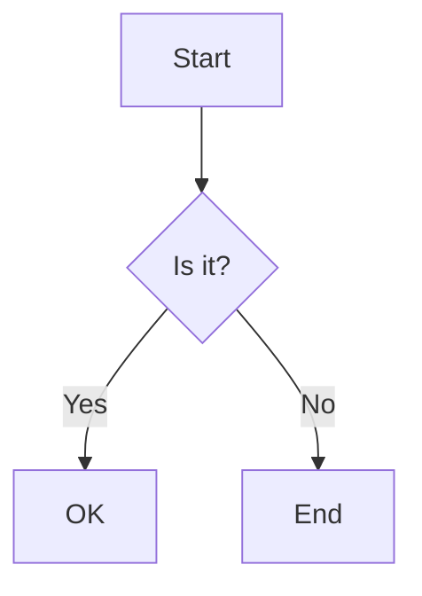
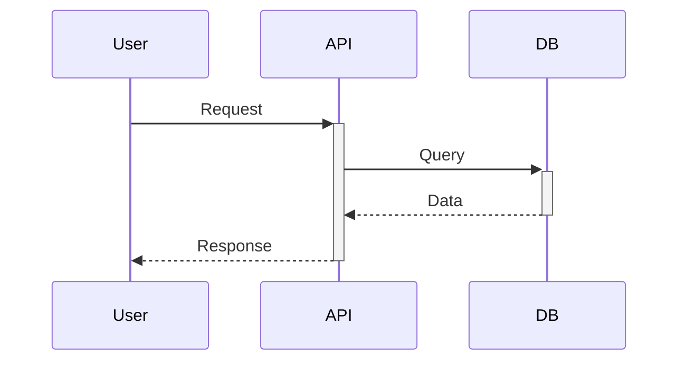
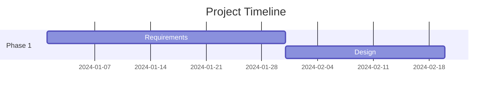
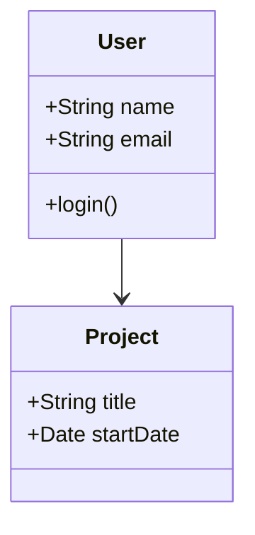

# Mermaid.js AI Integration Guide

## Overview

This project now includes Mermaid.js diagram generation powered by your local AI (Ollama with Llama 3.1 8B). You can generate flowcharts, sequence diagrams, Gantt charts, and more using natural language prompts.

## Features

- **8 Diagram Types**: Flowchart, Sequence, Gantt, Class Diagram, State Diagram, ER Diagram, User Journey, Mind Map
- **AI-Powered**: Uses your existing n8n workflow with Llama 3.1 8B
- **Context-Aware**: Automatically includes page context (project name, stats, etc.)
- **Bilingual**: Full Arabic and English support
- **Export Options**: Download diagrams as SVG or copy Mermaid code
- **Live Preview**: See diagrams render in real-time

## Quick Start

### 1. Using the Diagram Generator

On the **Project Requirements** page, click the "Generate Diagram" button (Network icon).

### 2. Choose Diagram Type

Select from the dropdown:
- **Flowchart**: Process flows, decision trees
- **Sequence Diagram**: System interactions, API calls
- **Gantt Chart**: Project timelines, task schedules
- **Class Diagram**: Software architecture
- **State Diagram**: State machines, workflows
- **ER Diagram**: Database schema
- **User Journey**: UX flows
- **Mind Map**: Brainstorming, hierarchical ideas

### 3. Write Your Prompt

Examples:
```
Create a flowchart for the requirement approval process
```

```
Generate a sequence diagram showing how a user submits a requirement
```

```
Make a Gantt chart for the next 3 months of project development
```

### 4. Generate & Preview

- Press Enter or click "Generate"
- AI will create Mermaid code
- Switch to "Preview" tab to see the rendered diagram
- Switch to "Code" tab to see/copy the Mermaid syntax

### 5. Export or Save

- **Download SVG**: Click "Download SVG" button
- **Copy Code**: Click "Copy Code" to paste into documentation
- Save the code for later use

## Adding to Other Pages

To add the diagram generator to any page:

```tsx
import AIDiagramGenerator from "@/components/AIDiagramGenerator";
import { Network } from "lucide-react";

// Add state
const [isDiagramModalOpen, setIsDiagramModalOpen] = useState(false);

// Add button
<Button
  startContent={<Network className="w-4 h-4" />}
  onPress={() => setIsDiagramModalOpen(true)}
>
  {t("ai.generateDiagram")}
</Button>

// Add modal
<AIDiagramGenerator
  isOpen={isDiagramModalOpen}
  onClose={() => setIsDiagramModalOpen(false)}
  context="Your page context here"
  contextTitle="Page Title"
/>
```

## Using MermaidDiagram Component Directly

If you have pre-written Mermaid code:

```tsx
import MermaidDiagram from "@/components/MermaidDiagram";

<MermaidDiagram
  chart={`
    graph TD
      A[Start] --> B{Decision}
      B -->|Yes| C[Action 1]
      B -->|No| D[Action 2]
  `}
  title="My Flowchart"
  showControls={true}
/>
```

## Mermaid Syntax Examples

### Flowchart


### Sequence Diagram


### Gantt Chart


### Class Diagram


## AI Model Recommendations

### Current Setup (Llama 3.1 8B)
- ✅ Works well for basic to intermediate diagrams
- ✅ Fast response time (~700-900ms)
- ✅ Good understanding of requirements context
- ⚠️ May struggle with very complex diagrams

### Upgrade Options

For better diagram generation:

1. **Qwen2.5-Coder 7B** (Best for technical diagrams)
   ```bash
   ollama pull qwen2.5-coder:7b
   ```
   - Excellent at software architecture
   - Better code structure understanding
   - Similar performance to Llama 3.1

2. **Llama 3.2 11B Vision** (Better context awareness)
   ```bash
   ollama pull llama3.2:11b
   ```
   - More intelligent diagram generation
   - Better at complex relationships
   - Requires more GPU memory (~8GB)

3. **DeepSeek-Coder-V2 16B** (Best overall, if your GPU supports it)
   ```bash
   ollama pull deepseek-coder-v2:16b
   ```
   - Most accurate technical diagrams
   - Best at large system architectures
   - Requires ~12GB GPU memory

### Switching Models

Update your n8n workflow to use a different model - no code changes needed!

## Tips for Better Diagrams

1. **Be Specific**: "Create a flowchart showing the approval process with 3 steps" vs "make a flowchart"
2. **Include Details**: Mention names, steps, or components you want to see
3. **Use Context**: The AI sees your current page context automatically
4. **Iterate**: Generate, review, then ask for modifications in a new prompt
5. **Export Examples**: Save good prompts for reuse

## Troubleshooting

### Diagram Won't Render
- Check the "Code" tab for syntax errors
- AI may have added markdown markers - the component removes them automatically
- Try a simpler prompt first

### Slow Generation
- Normal: 700-900ms for Llama 3.1 8B
- Check n8n workflow is running: http://localhost:5678
- Check Ollama is running: http://localhost:11434

### Wrong Diagram Type
- Be explicit: "Create a **sequence diagram** showing..."
- Select the diagram type from dropdown before generating

## Resources

- [Mermaid.js Official Docs](https://mermaid.js.org/)
- [Mermaid Live Editor](https://mermaid.live/) - Test syntax
- [n8n Workflow](http://localhost:5678) - Your local n8n instance

## Support

The AI diagram generator uses your existing infrastructure:
- **n8n**: http://localhost:5678
- **Ollama**: http://localhost:11434
- **Model**: Llama 3.1 8B (or your chosen model)

No additional setup required!
